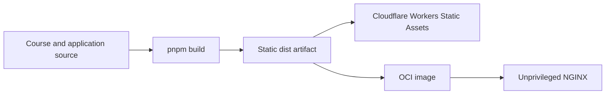
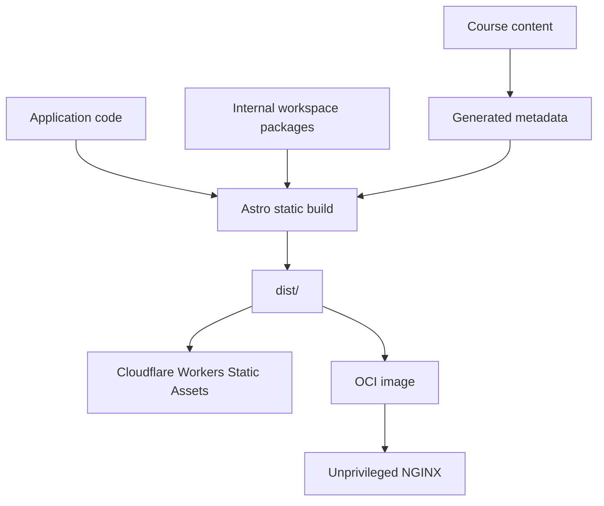
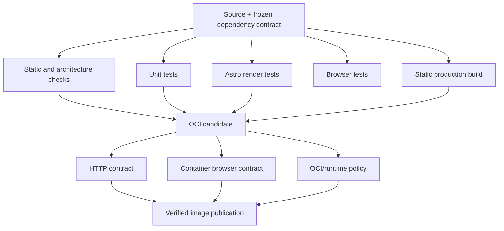

# DIBS — Design and Implementation of Software Libraries

## Diseño e Implementación de Bibliotecas de Software

DIBS is an online, university-level course about designing and implementing software libraries.

The course is designed for autonomous study. Its website is also a real software project used to demonstrate several of
the architectural, testing, reproducibility, and software-quality practices discussed in the course.

- **Course:** [dibs.ravenhill.cl](https://dibs.ravenhill.cl)
- **Course language:** Spanish
- **Repository documentation:** English
- **Production model:** static Astro site
- **Primary local production-like execution:** Docker

## For students

You do **not** need to clone or build this repository to study DIBS.

Start at:

**[dibs.ravenhill.cl](https://dibs.ravenhill.cl)**

The public site contains the course lessons, exercises, supplementary material, and bibliographic references.

If you are interested only in the course content, the rest of this README is optional.

## Run the website locally

The recommended way to run the production website locally is with Docker.

DIBS is generated as a static site. The container serves the generated `dist/` artifact with unprivileged NGINX on port
`8080`; Astro, Node.js, pnpm, and the application source are not part of the production runtime.



### Requirements

To build the image locally you need:

- Docker with BuildKit support;
- access to the GitLab npm registry used by the `@ravenhill` packages;
- an authenticated npm configuration stored **outside this repository**.

The npm configuration is passed to BuildKit as a temporary secret. Registry credentials must not be passed through
Docker `ARG`, `ENV`, or committed configuration files.

### Build the image

Set `NPM_CONFIG_USERCONFIG` to an npm configuration that can access the required GitLab packages.

#### PowerShell

```powershell
$env:NPM_CONFIG_USERCONFIG = "$HOME\.npmrc"

docker build `
    --secret "id=npmrc,src=$env:NPM_CONFIG_USERCONFIG" `
    --tag dibs-astro:local `
    .
```

#### POSIX shell

```sh
export NPM_CONFIG_USERCONFIG="$HOME/.npmrc"

docker build \
    --secret id=npmrc,src="$NPM_CONFIG_USERCONFIG" \
    --tag dibs-astro:local \
    .
```

### Run the container

```sh
docker run \
    --rm \
    --read-only \
    --tmpfs /tmp \
    --publish 8080:8080 \
    dibs-astro:local
```

Open:

http://localhost:8080

The container runs without root privileges. Its root filesystem is read-only, with `/tmp` provided explicitly for the
temporary state required by NGINX.

### Verify the production container

The repository includes a container contract that builds and checks the production image:

```sh
node scripts/test-container.mjs
```

`NPM_CONFIG_USERCONFIG` must be configured as described above.

The contract checks representative production behavior, including:

- the homepage;
- a representative lesson;
- generated Astro assets;
- the custom 404 page;
- legacy route behavior;
- non-root execution;
- absence of Node.js, pnpm, source code, installed development dependencies, and npm credentials from the runtime image.

The harness removes only the temporary resources it creates.

---

# For contributors and maintainers

Use the direct Node.js workflow when editing course material, components, styles, metadata, tests, or build
infrastructure.

## Development toolchain

The canonical development environment is:

- Node.js `24.11.0`;
- pnpm `11.8.0`.

These versions are declared by the repository rather than being informal recommendations.

Enable the expected pnpm version through Corepack:

```sh
corepack enable
corepack prepare pnpm@11.8.0 --activate
```

The project also depends on packages from the `@ravenhill` GitLab npm registry, so dependency installation requires
appropriate registry authentication.

Install dependencies using the committed lockfile:

```sh
pnpm install --frozen-lockfile
```

Do not update the lockfile merely to make a local installation succeed. If the frozen installation fails, identify the
dependency or environment mismatch first.

## Start the development server

```sh
pnpm dev
```

The development command prepares the generated and workspace artifacts required by the site before starting Astro.

The development server is intended for editing and interactive development. It is **not** the production runtime;
production delivery uses the static `dist/` artifact.

## Validate a change

During development, run the narrowest test or check relevant to the behavior you are modifying.

Before completing a substantial change, run the complete applicable quality gates.

### Common commands

| Command                           | Purpose                                                                    |
| --------------------------------- | -------------------------------------------------------------------------- |
| `pnpm check`                      | Runs toolchain, generated-data, workspace, Astro, and architecture checks. |
| `pnpm test:unit`                  | Runs the ordinary Vitest suite.                                            |
| `pnpm test:astro`                 | Runs Astro component/render tests.                                         |
| `pnpm test:e2e`                   | Runs browser-level Playwright tests.                                       |
| `pnpm test`                       | Runs the repository's default automated test contract.                     |
| `pnpm build`                      | Produces the canonical static site in `dist/`.                             |
| `node scripts/test-container.mjs` | Builds and verifies the production OCI runtime locally.                    |
| `pnpm fmt`                        | Formats supported repository files with dprint.                            |

A typical complete validation sequence is:

```sh
pnpm check
pnpm test
pnpm test:e2e
pnpm build
```

Run the container contract as well when modifying:

- the Dockerfile;
- NGINX configuration;
- static routing behavior;
- runtime security policy;
- generated asset delivery;
- container-related CI.

The container contract is intentionally separate from the default test suite because it requires a local container
runtime and authenticated package-registry access.

## Architecture

DIBS uses Astro as a static-site generator with React islands for interactive behavior.

The canonical deployment artifact is `dist/`.



Cloudflare and OCI are **delivery mechanisms**, not separate application implementations. Both serve the same
static-site contract.

The project currently uses:

- Astro 7;
- React 19 islands;
- Tailwind CSS 4;
- TypeScript 6;
- Vitest for unit and Astro-render testing;
- Playwright for browser-level testing;
- pnpm workspaces for reusable internal packages.

Architectural dependency rules are documented in:

[`docs/architecture/layer-separation.md`](./docs/architecture/layer-separation.md)

## Repository structure

```text
src/
├── assets/          project-owned static assets
├── components/      reusable UI and semantic components
├── data/            structured course and bibliography data
├── layouts/         shared page layouts
├── pages/           public routes and course lessons
└── presentation/    presentation-facing adapters

packages/
├── content-core/        content-domain functionality
├── lesson-export-core/  lesson export functionality
├── shiki-core/          syntax-highlighting functionality
└── site-core/           reusable site functionality

docker/
└── default.conf     static NGINX serving configuration

scripts/             generation, validation, export, build, and CI tooling
docs/                architecture, operations, attribution, and maintenance documentation
```

Course-facing pages primarily live under `src/pages/`.

Structured navigation, bibliography data, generated metadata, and other non-presentation contracts are maintained
separately so that page components do not become responsible for application-wide data rules.

## Generated artifacts

Several parts of the site are generated from canonical source data.

When changing content or metadata:

1. use the repository's existing generation commands;
2. do not manually edit generated output unless that file explicitly documents itself as editable;
3. run `pnpm check`;
4. confirm generation does not leave unexpected tracked changes.

Generated artifacts should be deterministic: the same source and toolchain should produce the same repository state.

## Container architecture

The Docker image uses a multi-stage build.

### Build stage

The build stage contains:

- Node.js;
- pnpm;
- source code;
- workspace packages;
- build dependencies.

It installs dependencies using the frozen lockfile and runs the canonical `pnpm build` path.

Private npm authentication is available only during dependency installation through a BuildKit secret mount.

### Runtime stage

The runtime contains the generated site and the minimum NGINX runtime needed to serve it.

It intentionally excludes:

- Node.js;
- pnpm;
- `node_modules`;
- project source;
- Git metadata;
- npm credentials;
- build caches.

The runtime listens on port `8080` and runs without root privileges.

The Dockerfile remains platform-neutral. Supported publication platforms are selected by CI.

## CI model

GitLab CI keeps different assurance boundaries separate rather than treating one successful job as evidence for every
property.

The intended flow is:



The OCI pipeline uses rootless BuildKit. It does not require Docker-in-Docker, privileged execution, or a mounted host
Docker socket.

Package-registry credentials are supplied temporarily during the build and must not be persisted into the image.

Operational details for the self-hosted GitLab Runner are documented in:

[`docs/gitlab-runner-setup.md`](./docs/gitlab-runner-setup.md)

## Deployment

DIBS has two delivery targets for the same `dist/` artifact.

### Cloudflare Workers Static Assets

Cloudflare is the public website's existing production delivery target.

The deployment command is:

```sh
pnpm deploy
```

Wrangler publishes the generated static artifact according to `wrangler.toml`.

### OCI image

The OCI image packages the same static site behind unprivileged NGINX.

This provides a portable, production-like runtime for:

- local verification;
- CI;
- reproducibility;
- alternate hosting environments.

Dockerization does not introduce a second application runtime or change the semantics of the Astro site.

## PDF lesson export

Some lessons can be exported as PDF documents through the browser-backed export pipeline.

| Command                   | Purpose                                             |
| ------------------------- | --------------------------------------------------- |
| `pnpm export:pdf`         | Exports selected lesson routes.                     |
| `pnpm export:pdf:all`     | Exports all PDF-capable lessons.                    |
| `pnpm export:pdf:dry-run` | Resolves export targets without launching Chromium. |
| `pnpm export:pdf:smoke`   | Exports one representative lesson.                  |
| `pnpm test:pdf-smoke`     | Runs the opt-in end-to-end PDF export contract.     |

The PDF pipeline is not part of the default quality gate because it requires a browser runtime.

## Course-content conventions

Course content is written in Spanish.

Repository-level implementation and maintenance documentation is written in English.

When contributing course material:

- preserve the pedagogical progression of the surrounding lesson;
- keep code examples in English;
- preserve bibliography and attribution metadata;
- use existing content components and conventions where possible;
- avoid coupling lesson prose to implementation details that students do not need to know.

The website is both educational material and software, so content changes should preserve both pedagogical clarity and
build correctness.

## Troubleshooting

Repository-specific troubleshooting belongs in focused documents under `docs/` rather than accumulating indefinitely in
this README.

### Astro/Vite `fetchModule` timeout

For the known timeout involving `src/styles/global.css`, see:

[`docs/troubleshooting-vite-fetchmodule-timeout.md`](./docs/troubleshooting-vite-fetchmodule-timeout.md)

### GitLab Runner and container infrastructure

See:

[`docs/gitlab-runner-setup.md`](./docs/gitlab-runner-setup.md)

When adding a recurring operational issue, prefer creating or extending a focused runbook and linking it here.

## Contributing

This repository is maintained as both:

1. the public DIBS course;
2. a software project supporting the course.

Changes should preserve:

- pedagogical clarity for students;
- Spanish course content;
- English repository-level documentation;
- explicit architectural boundaries;
- reproducible generated artifacts;
- attribution and licensing requirements;
- deterministic checks where practical;
- the distinction between the static application artifact and its delivery mechanisms.

Before submitting a substantial change:

1. run the narrowest tests relevant to the change;
2. run the complete applicable quality gates;
3. verify generated artifacts remain canonical;
4. run the container contract if the deployment/runtime boundary changed.

Additional contribution guidance:

- [`CONTRIBUTING.md`](./CONTRIBUTING.md)
- [`CODE_OF_CONDUCT.md`](./CODE_OF_CONDUCT.md)
- [`docs/architecture/layer-separation.md`](./docs/architecture/layer-separation.md)

## License

DIBS is licensed under the [BSD 2-Clause License](./LICENSE).

Third-party assets retain their respective licenses and attribution requirements.

See:

- [`docs/third-party-assets.md`](./docs/third-party-assets.md)
- [`docs/licenses/`](./docs/licenses/)
