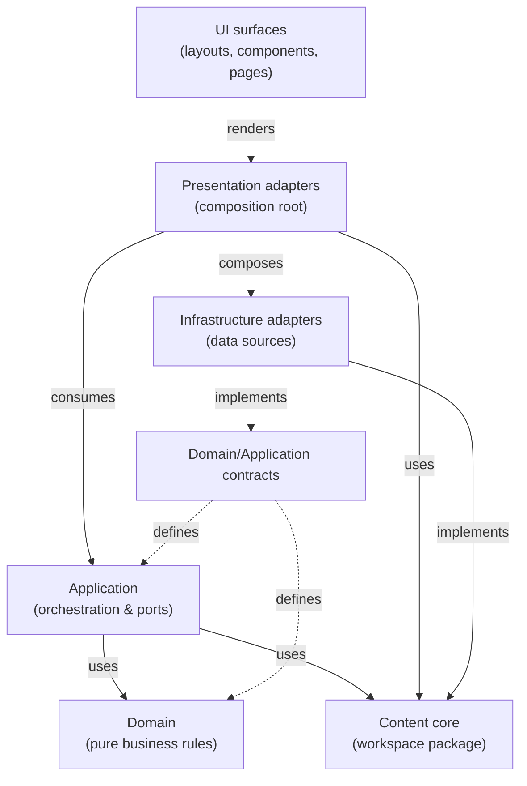

# Layer Separation

This note is the current-state architecture reference for the `astro-website` repo after the Phase 2 domain-isolation
cycles and the Cycle 8 integration lock-in.

Older Phase 0 and Phase 1 notes remain useful as historical implementation records, but they should not be treated as
the authoritative description of the current boundaries when they conflict with this document.

## Terminology

- **Domain**: Pure business rules and use-case logic, free of frameworks and I/O.
- **Application**: Orchestration layer that composes domain entities and ports, returning DTOs to callers.
- **Content core**: Workspace package with host-agnostic navigation and lesson metadata contracts shared by the app.
- **Infrastructure**: Concrete data-source implementations and external service adapters.
- **Presentation adapters**: Local composition root for UI use cases; bridges application services to UI-safe payloads.
- **UI surfaces**: Astro layouts, React components, and pages that render presentation DTOs.

## Current Architecture Contract

The repo uses a layered structure inside `src/`:

- `packages/content-core`
  - Owns extracted pure lesson-navigation and lesson-metadata contracts, branded value helpers, DTOs, explicit result
    contracts, repository interfaces, and application services.
  - Contains no Astro imports, generated JSON imports, Zod schemas, course-structure data, UI components, or app-local
    aliases.

- `src/domain`
  - Owns app-local domain models and reference-content resolution rules that have not been extracted.
  - Contains no Astro slot I/O, generated JSON imports, zod schemas, or adapter wiring.

- `src/application`
  - Remains available for app-local orchestration that has not moved into `@ravenhill/content-core`.
  - Phase 1 moved lesson navigation and lesson metadata services/contracts into the workspace package.

- `src/infrastructure/adapters`
  - Owns mapping from concrete data sources into domain-facing repository contracts.
  - `LessonCatalogAdapter` maps `courseStructure` into the lesson-navigation repository shape.
  - `LessonMetadataAdapter` maps the generated metadata dataset into branded lesson-metadata records and returns
    explicit found/missing/invalid lookup results.

- `src/presentation/adapters`
  - Owns local composition for UI consumers such as `NotesLayout`.
  - Bridges presentation callers to application services and returns only UI-safe serializable payloads.
  - Owns view-model shaping and normalization when UI rendering needs domain or application behavior.

- `src/layouts`, `src/components`, `src/pages`
  - Own the Astro and React rendering surface.
  - Consume presentation adapters and small UI payloads rather than domain entities, application DTOs, or infrastructure
    sources directly.

## Current Implementation Status

The main content seams are now present in code:

- Navigation rules and lesson metadata helpers are centered in `packages/content-core` and consumed through
  repository/service boundaries.
- Reference-content business rules live in `src/domain/reference-content.ts`.
- The generated lesson metadata dataset boundary remains app-local in `src/utils/lesson-metadata.ts`.
- Presentation composition for lesson navigation and lesson metadata lives in:
  - `src/presentation/adapters/navigation-bridge.ts`
  - `src/presentation/adapters/course-navigation.ts`
  - `src/presentation/adapters/navigation-normalization.ts`
  - `src/presentation/adapters/lesson-metadata-bridge.ts`
  - `src/presentation/adapters/lesson-metadata-panel.ts`
- Reference slot/content resolution is exposed to UI components through presentation-owned helpers.
- Presentation-facing adapters also expose site metadata, static UI data, and the default bibliography catalog without
  requiring UI files to import from `src/data/*`.

At the UI boundary, `NotesLayout.astro` resolves:

- sidebar data through `getCourseNavigationTree()`
- automatic previous/next navigation through `resolveAutoNav(pathname, courseNavigationTree)`
- lesson metadata through `resolveLessonMetadata(pathname)`

These paths are locked with high-value test suites:

- `src/layouts/__tests__/NotesLayout.render.test.ts`
- `src/presentation/adapters/__tests__/navigation-bridge.test.ts`
- `src/presentation/adapters/__tests__/lesson-metadata-bridge.test.ts`
- reference render suites under `src/components/ui/references/__tests__`

## Layer Rules

| Source layer                                          | Allowed targets                                                                                  | Forbidden targets/packages                                                                              | Notes                                   |
| ----------------------------------------------------- | ------------------------------------------------------------------------------------------------ | ------------------------------------------------------------------------------------------------------- | --------------------------------------- |
| `packages/content-core/src/**`                        | `content-core`                                                                                   | app-local layers, data, generated data, utilities, assets, styles, `astro`, `react`, `react-dom`, `zod` | Host-agnostic shared core.              |
| `src/domain/**`                                       | `domain`, `content-core`                                                                         | `application`, `infrastructure`, `presentation`, `ui`, `astro`, `react`, `zod`                          | Pure app-local business rules only.     |
| `src/application/**`                                  | `domain`, `application`, `content-core`                                                          | `infrastructure`, `presentation`, `ui`, `data`, `generated-data`, `astro`, `react`, `zod`               | App-local orchestration and ports only. |
| `src/infrastructure/**`                               | `domain`, `application`, `infrastructure`, `data`, `generated-data`, `utilities`, `content-core` | `presentation`, `ui`                                                                                    | Concrete data-source implementations.   |
| `src/presentation/adapters/**`                        | `domain`, `application`, `infrastructure`, `presentation`, `utilities`, `content-core`           | `ui`, `components`, `layouts`, `pages`                                                                  | Local composition root.                 |
| `src/components/**`, `src/layouts/**`, `src/pages/**` | `presentation/adapters`, `presentation`, `ui`, `assets`, `styles`, `utilities`, `content-core`   | `domain`, `application`, `infrastructure`                                                               | Rendering surface.                      |

**Implementation notes:**

- Type-only imports are checked as architectural dependencies.
- Package subpaths are normalized: `react/jsx-runtime` → `react`, `zod/v4` → `zod`.
- `@ravenhill/content-core` must be consumed through the package root; package subpath imports are not allowed.
- Generated data: `src/data/**/*.generated.json` and `src/data/**/*.generated.jsonld` are classified as
  `generated-data`.
- Astro support scans only frontmatter imports, not template text.

## Dependency flow

The intended dependency direction is:



`src/presentation/adapters/**` is the local composition root for UI-facing use cases. Other presentation and UI code
should not import infrastructure directly.

In practical terms:

- UI code should not reach into infrastructure adapters directly
- UI code should not import domain or application internals directly; use presentation adapters, helpers, or view models
- UI code should not import raw modules from `src/data/*`; route data access through presentation-facing adapters
- application and content-core code should not depend on Astro, React, slots, generated JSON modules, or zod validation
  concerns
- domain code should remain framework-free and I/O-free

## Boundary Checker

The boundary checker scans `.ts`, `.tsx`, and `.astro` files under `src/`, plus TypeScript files under
`packages/content-core/src/`, and evaluates imports against the layer rules above. The checker:

- Resolves project aliases from `tsconfig.json`
- Normalizes relative paths
- Extracts imports and re-exports through `es-module-lexer` with a TSX fallback
- Classifies sources, targets, and packages into the normalized layer vocabulary
- Returns boundary findings in deterministic order by `sourceFile`, `importTarget`, and `ruleId`

## Verification

Architecture boundary checks are part of the standard local gate:

```bash
pnpm check
```

Use the focused boundary gate when debugging architecture findings:

```bash
pnpm check:architecture
```

The focused command runs `node scripts/check-layer-boundaries.mjs` and should finish with:

```txt
No layer boundary findings found.
```

Run the checker test suites when changing the checker itself:

```bash
pnpm vitest run \
  scripts/__tests__/layer-boundary-checker.test.ts \
  scripts/__tests__/layer-boundary-imports.test.ts \
  scripts/__tests__/layer-boundary-rule-evaluation.test.ts \
  scripts/__tests__/layer-boundary-classification.test.ts \
  scripts/__tests__/layer-boundary-paths.test.ts \
  scripts/__tests__/layer-boundary-rules.test.ts
```

**Checker test file responsibilities:**

- `layer-boundary-checker.test.ts`: Core rule enforcement, import parsing, path resolution, exceptions, output
  formatting, and CLI exit codes
- `layer-boundary-imports.test.ts`: Import extraction from TypeScript, TSX, and Astro files (static and dynamic imports,
  re-exports)
- `layer-boundary-paths.test.ts`: Path normalization, alias resolution, and layer classification
- `layer-boundary-classification.test.ts`: Source layer, target layer, and package classification helpers
- `layer-boundary-rule-evaluation.test.ts`: Rule matrix evaluation, exception matching, and finding generation
- `layer-boundary-rules.test.ts`: Rule matrix structure, allowed/forbidden directions, and package restrictions

The CLI can also be run directly:

```bash
node scripts/check-layer-boundaries.mjs
```

GitLab CI runs `pnpm check`, so architecture boundary findings block the standard CI verification path.

**API note:** `runBoundaryCheck(...)` exposes `findings` as the preferred result field. The older result shape remains
as a compatibility alias. New code should read `findings`; the alias will be removed after all internal callers migrate.

## Adding New Code

When adding new source files:

- Put reusable host-agnostic navigation and lesson metadata core in `packages/content-core/src/`.
- Put app-local pure business rules and domain logic in `src/domain/`.
- Put app-local use-case orchestration and port contracts in `src/application/`.
- Put data-source mapping and external adapters in `src/infrastructure/adapters/`.
- Put UI composition bridges in `src/presentation/adapters/`.
- Put Astro/React rendering code in `src/layouts/`, `src/components/`, or `src/pages/`.

If a UI file needs data from a service or external source, add or extend a presentation adapter instead of importing
infrastructure directly. This keeps architectural boundaries clear and makes the data flow testable.

Examples:

- Valid: UI imports `getCourseNavigationTree` from `$presentation/adapters/course-navigation`.
- Valid: UI imports view-model or normalization helpers from `$presentation/adapters/*`.
- Valid: a presentation adapter imports an infrastructure adapter to retrieve static site data.
- Valid: app code imports extracted navigation or metadata contracts from `@ravenhill/content-core`.
- Not allowed: UI imports `~/data/course-structure`, `~/data/site`, or `~/data/bibliography/catalog` directly.
- Not allowed: UI imports `$domain/reference-content` or `$application/ports` directly.
- Not allowed: application code imports `astro`, `react`, `zod`, generated data, or UI components.
- Not allowed: any code imports from `@ravenhill/content-core/*` package subpaths.

## Presentation Adapter Contracts

The main presentation-facing contracts locked in during this phase are:

- `resolveAutoNav(pathname, lessons)`
  - returns only `{ previous?, next? }`
  - each link is `{ title, href }`
  - is implemented through `NavigationService` from `@ravenhill/content-core`
  - does not expose slugs, lesson entities, or infrastructure-specific records

- `getCourseNavigationTree()`
  - returns the sidebar tree through the presentation boundary
  - keeps the raw course-structure module owned by infrastructure/data access

- `resolveLessonMetadata(pathname)`
  - returns an explicit result object
  - exposes DTO-shaped serializable metadata only when `kind === "found"`
  - preserves missing and invalid metadata states without rendering infrastructure records
  - is implemented through `LessonMetadataService` from `@ravenhill/content-core`
  - does not expose infrastructure-only fields such as `sourceFile`

- `buildLessonMetaPanelViewModel(...)`
  - formats metadata-panel display values and commit links for UI rendering
  - keeps date formatting and application DTO coupling out of the Astro component

- reference-content presentation helpers
  - adapt domain reference-content rules into rendering-oriented helpers
  - keep slot precedence and missing-title behavior stable without UI importing domain modules

- `getWebsiteRepoRef(platform)`, `getDefaultBibliographyCatalog()`, and the static UI data helpers
  - expose existing static data through explicit presentation-facing modules
  - keep UI components free from direct `src/data/*` imports

`NotesLayout.astro` currently renders previous/next navigation through these contracts. Breadcrumb behavior is not yet a
locked contract.

## Intentional Exceptions

The executable allowlist is currently empty. New exact exceptions must be added in
`scripts/lib/layer-boundary-rules.mjs`, include a reason, and be mirrored in this section. Do not add broad wildcard
exceptions.

Some transitional or infrastructure-support files exist by design:

- `src/utils/lesson-metadata.ts`
  - **Status**: Transitional infrastructure-support module.
  - **Allowed because**: Owns generated JSON loading, zod validation, dataset caching, and lookup support.
  - **Exit condition**: Move generated-data loading behind an infrastructure adapter or dedicated data-access module.

- `src/components/ui/references/reference-content.ts`
  - **Status**: Astro/UI adapter module.
  - **Allowed because**: Owns slot reading, slot preparation, and UI-facing error translation.
  - **Exit condition**: Pure precedence and content-resolution rules should live in `src/domain/reference-content.ts`
    only.

- `src/components/ui/references/thesis-reference.ts`
  - **Status**: UI-facing view-model resolver for `Thesis.astro`.
  - **Allowed because**: Owns component runtime contracts such as required href validation and linked metadata label
    validation.
  - **Exit condition**: Once all Thesis-specific policy is component-localized, remove domain-layer duplication.

- `src/utils/navigation.ts`
  - **Status**: Compatibility wrapper.
  - **Allowed because**: Re-exports presentation-owned navigation normalization for older imports.
  - **Exit condition**: Remove once all callers use `$presentation/adapters/navigation-normalization` directly.

## Historical Implementation Notes

The checker was developed through the Cycle 2 hardening work, with major milestones:

**Cycle 2 Step 1** locked the baseline checker behavior with tests for imports, paths, and basic functionality.

**Cycle 2 Step 2** added classification helpers that normalize source paths, resolved project targets, bare package
imports, and import records into the layer vocabulary used by the rule matrix.

**Phase 1 content-core extraction** added `packages/content-core/src/**` as a checked source layer and allowed app
layers to consume `@ravenhill/content-core` through the package root.

**Cycle 2 Step 4** moved rule evaluation into `scripts/lib/layer-boundary-rule-evaluation.mjs` and wired classifiers
into the rule matrix. Evaluation now checks exact exceptions, forbidden packages, forbidden targets, and allowed-target
lists, returning public boundary findings and formatted CLI output.

**Cycle 2 Steps 5 and 6** preserved the public CLI/reporting contract and expanded rule matrix tests to cover each
allowed and forbidden direction, package restrictions, package subpath normalization, generated JSON classification,
type-only import enforcement, and exact exception behavior.

**Cycle 2 Step 7** consolidated the test suite under `pnpm test:unit` and confirmed high-value integration coverage with
existing suites.

**Cycle 2 Step 8** strengthened the integration suite around structured boundary findings, deterministic ordering by
`sourceFile`, `importTarget`, and `ruleId`, and standardized "Layer boundary finding" terminology. The API now exposes
`findings` as the preferred result field with a compatibility alias for the older shape. Astro file scanning was
narrowed to frontmatter imports, and type-only import detection was refined to correctly classify mixed value/type
imports.

## Documentation Status

Use this file as the current architecture summary.

Treat these files as historical implementation records unless explicitly updated for current-state accuracy:

- `docs/architecture/PHASE-1-CHECKLIST.md`
- `docs/architecture/PHASE-1-TREE.md`
- `docs/architecture/PHASE-1-RESUMEN.md`
- `docs/architecture/Phase-1-summary.md`

Those notes document the Phase 1 rollout and still contain references to earlier transitional states such as "Domain
stub" or "NotesLayout integration pending." When that historical framing conflicts with the current codebase, the
current code and this note take precedence.
