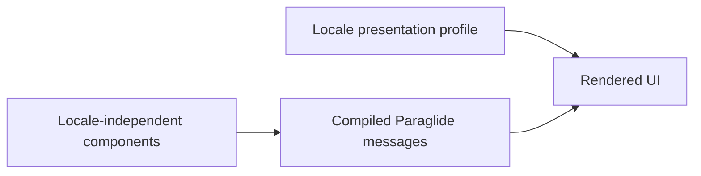

# UI localization readiness

DIBS remains a Spanish-only course site. This work localizes reusable UI chrome and preserves regional formatting; it
does not translate lessons, add localized routes, negotiate a locale, or add SEO language alternates.

The initial `es` profile uses `lang="es"`, `es-CL` for `Intl` formatting, and `es_CL` for Open Graph metadata. English
citation metadata retains its existing `en_GB` Open Graph mapping; it is not a second UI locale.

To add a future UI-chrome locale, add its catalog under `messages/`, declare it in `project.inlang/settings.json`, and
add a complete `LocaleProfile`. The generated message API will identify missing messages or parameters at compile time.
Existing components should not need localization-specific rewrites.

React islands receive resolved localized text as props. They do not select a locale or import a locale runtime.
Localized routes and course-content translation require separate design work.

`@ravenhill/content-core` now exposes lesson-date semantics (`known`, `missing`, or `passthrough`) rather than localized
date strings. Consumers must format known dates and choose missing-date text at their own presentation boundary.
