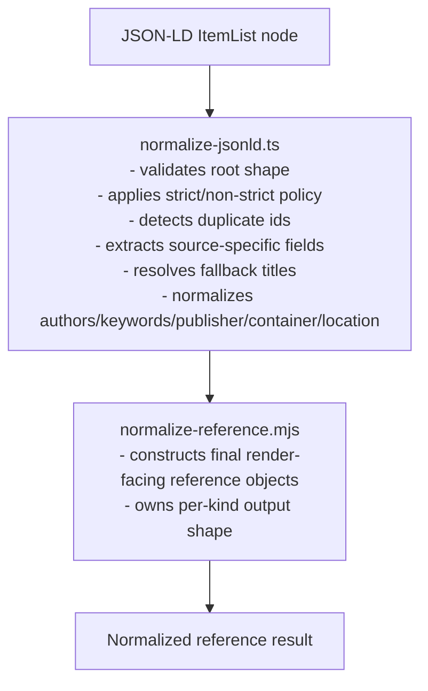

## [DONE] Cycle 6 — Centralize `ItemList` Reference Construction

## Summary

Refactor the JSON-LD `ItemList` normalization path so `src/lib/bibliography/normalize-jsonld.ts` remains responsible for
**JSON-LD extraction and policy**, while final render-facing reference construction is delegated to the shared
normalizer.

The current blocker is that `WebPage` is still missing from the shared normalizer. Therefore, Cycle 6 should first add
shared `WebPage` normalization, then migrate the remaining inline `ItemList` branches in a bounded sequence.

This cycle must preserve:

- public `parseBibliography` behavior;
- strict/non-strict error policy;
- duplicate detection;
- fallback-title extraction;
- author, keyword, publisher, container-title, and location extraction semantics;
- existing normalized output shapes.

Catalog rewiring in `src/lib/bibliography/catalog-core.mjs` remains explicitly out of scope for Cycle 7.

---

## Scope

### Included

- Add `WebPage` support to the shared reference normalizer.
- Rewire `ItemList` normalization in `normalize-jsonld.ts` so supported kinds delegate final construction.
- Keep `normalize-jsonld.ts` as the extraction boundary.
- Add direct normalizer tests and caller-level regression tests.
- Update migration-status documentation.

### Excluded

- Rewiring `catalog-core.mjs`.
- Render component changes.
- Generated artifact changes.
- Broad helper extraction shared across catalog and JSON-LD paths.
- Behavioural changes to `parseBibliography`.

---

## Target Architecture

After this cycle:



The key boundary is:

> `normalize-jsonld.ts` extracts source-specific data; `normalize-reference.mjs` constructs normalized references.

---

## TDD Cycles

### Cycle 6.1 — Lock `WebPage` Shared Normalization Contract

#### Red

Add direct tests in:

```text
src/lib/bibliography/__tests__/normalize-reference.test.ts
```

Cover:

1. `normalizeWebPageReference` returns the current `WebPage` normalized shape.
2. The dispatcher accepts `kind: "WebPage"`.
3. Explicit `publisherName` takes precedence over hostname fallback.
4. `locationUrl` falls back to the reference URL when not provided.
5. Optional fields remain omitted or defaulted exactly as the current inline path does.

#### Green

Update:

```text
src/lib/bibliography/normalize/normalize-reference-types.ts
src/lib/bibliography/normalize/normalize-reference.mjs
```

Add:

```ts
type WebPageNormalizationInput = {
    kind: "WebPage";
    id: string;
    rawType: string;
    title: string;
    description?: string;
    authors: NormalizedAuthor[];
    datePublished?: string;
    keywords: string[];
    url?: string;
    publisherName?: string;
    publisherUrl?: string;
    location?: string;
    locationUrl?: string;
    sourceLabel?: string;
};
```

The exact fields should match the current normalizer conventions. Keep the DTO source-independent: no raw JSON-LD nodes
should cross into the shared normalizer.

#### Refactor

- Keep `WebPage` construction logic small and symmetrical with the other normalizer functions.
- Prefer one dispatcher branch over special-case caller logic.
- Avoid premature extraction of shared helpers from `catalog-core.mjs`.

---

### Cycle 6.2 — Add Caller-Level Safety Net

#### Red

Add one or more tests in:

```text
src/lib/bibliography/__tests__/normalize-jsonld.test.ts
```

Use real `parseBibliography` input, not mocks.

Recommended tests:

1. `ScholarlyArticle` produced through `parseBibliography` matches the shared normalizer result.
2. `WebPage` preserves current publisher/location fallback behavior after delegation.
3. A mixed `ItemList` fixture with `Book`, `WebPage`, `VideoObject`, `ScholarlyArticle`, and `Thesis` preserves the
   previous normalized array shape.

The test should verify observable output, not implementation details.

#### Green

Only add enough code to keep the current inline implementation passing. Do not refactor branches yet.

#### Refactor

Extract or reuse small fixture builders if the test data becomes noisy.

---

### Cycle 6.3 — Rewire `WebPage`

#### Red

Run the caller tests and ensure they would fail if `WebPage` construction changed.

#### Green

In:

```text
src/lib/bibliography/normalize-jsonld.ts
```

Change the `WebPage` branch so it:

1. extracts fields from the JSON-LD node;
2. resolves location and publisher fields;
3. calls the shared normalizer;
4. returns the normalized result.

Do not move extraction helpers unless necessary.

#### Refactor

Remove only the dead inline `WebPage` object construction code.

---

### Cycle 6.4 — Rewire Remaining ItemList Kinds

Apply one kind at a time:

1. `VideoObject`
2. `ScholarlyArticle`
3. `Thesis`

For each kind:

#### Red

Ensure there is either:

- a direct existing regression test, or
- a small added fixture proving output equivalence.

#### Green

Replace inline final object construction with shared normalizer delegation.

#### Refactor

After each kind:

- remove dead object-construction code;
- keep extraction helpers if still used;
- avoid changing strict/non-strict control flow;
- run the focused test file.

Leave `Book` unchanged unless a tiny cleanup improves consistency without changing behaviour.

---

### Cycle 6.5 — Cleanup and Documentation

After all branches delegate final construction:

1. Remove dead inline construction helpers from `normalize-jsonld.ts`.

2. Keep extraction helpers such as:

   - `asString`
   - `asNumber`
   - `normalizeAuthors`
   - `getPublisher`
   - `getContainerTitle`
   - `getLocationFromUrl`

   as long as they still belong to JSON-LD extraction.

3. Do not deduplicate `getLocationFromUrl` with `catalog-core.mjs` in this cycle unless it is a trivial local move with
   no catalog behaviour change.

Update:

```text
src/data/bibliography/README.md
traceability-log/plan_phase_2_centralize_reference_normalization.md
traceability-log/plan_json_ld_references_workflow.md
```

State clearly:

- `ItemList` final construction now delegates to the shared normalizer.
- JSON-LD extraction remains in `normalize-jsonld.ts`.
- Catalog normalization remains pending for Cycle 7.

---

## File Checklist

### Production

```text
src/lib/bibliography/normalize-jsonld.ts
src/lib/bibliography/normalize/normalize-reference.mjs
src/lib/bibliography/normalize/normalize-reference-types.ts
```

### Tests

```text
src/lib/bibliography/__tests__/normalize-reference.test.ts
src/lib/bibliography/__tests__/normalize-jsonld.test.ts
src/lib/bibliography/__tests__/reference-normalization-equivalence.test.ts
```

### Documentation

```text
src/data/bibliography/README.md
traceability-log/plan_phase_2_centralize_reference_normalization.md
traceability-log/plan_json_ld_references_workflow.md
```

---

## Verification

Run after each relevant step:

```bash
pnpm vitest run src/lib/bibliography/__tests__/normalize-reference.test.ts
pnpm vitest run src/lib/bibliography/__tests__/normalize-jsonld.test.ts
pnpm vitest run src/lib/bibliography/__tests__/reference-normalization-equivalence.test.ts
```

Final verification:

```bash
pnpm vitest run src/lib/bibliography
pnpm exec tsc --noEmit
pnpm run check
```

---

## Acceptance Criteria

Cycle 6 is complete when:

- `WebPage` has a shared normalizer.
- The shared dispatcher supports all `ItemList`-supported reference kinds.
- `normalize-jsonld.ts` performs extraction but no longer owns final render-facing object construction for `WebPage`,
  `VideoObject`, `ScholarlyArticle`, or `Thesis`.
- `Book` remains behaviourally unchanged.
- Existing equivalence tests pass.
- Focused normalizer and JSON-LD tests pass.
- Migration-status docs explicitly mark `ItemList` as migrated and catalog normalization as pending.
