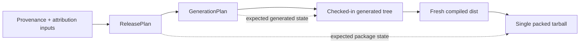

# Milestone 1 — Establish canonical generated-artifact consistency

## Summary

Establish one explicit, deterministic chain from authoritative release inputs to generated source and finally to the
**single packed artifact that is eligible for publication**.



The architecture should distinguish:

- **`ReleasePlan`** — what may be published;
- **`GenerationPlan`** — how planned assets map to generated source modules/exports;
- **observations** — what actually exists in the generated tree or package;
- **findings** — typed differences between an expectation and an observation.

The packed tarball remains the canonical **publishable artifact**. The typed plans remain the canonical **expectations**
used to determine whether that artifact is valid.

No public package API, supported asset set, package version, or consumer semantics change.

---

# Architectural invariants

The milestone should establish these invariants explicitly.

### I1 — One authoritative expectation chain

```text
validated provenance/attribution
        ↓
ReleasePlan
        ↓
GenerationPlan
```

No generator, build script, or package validator independently rediscovers which assets are publishable.

### I2 — Independent observations

Reuse typed expectations and finding types, but **do not reuse the same filesystem/package discovery implementation**
for all checks.

Prefer:

```text
GenerationPlan ───────┐
                      ├─ compare → findings
GeneratedTreeObserver ┘

ReleasePlan ──────────┐
                      ├─ compare → findings
TarballObserver ──────┘
```

rather than:

```text
shared discoverAssets()
        ↓
generator + verifier + tarball verifier
```

This reduces correlated false assurance.

### I3 — Exact generated-tree ownership

Within generator-owned roots:

```text
actual generated files == planned generated files
```

Therefore:

- missing files fail;
- stale files fail;
- unexpected shards fail;
- excluded assets fail if present;
- duplicate exports fail;
- no unplanned generated source is tolerated.

### I4 — Checks do not repair state

`generate:check` must be **read-only from the repository's perspective**.

It must not silently regenerate stale checked-in files and then report success.

### I5 — Production commands own and clean their outputs

The build and packaging stages must not consume stale outputs from previous executions.

Each command should operate on a known owned output root:

```text
build    owns dist/
pack     owns its selected archive-output directory
generate owns designated generated-source roots
```

Cleaning should be scoped to those explicitly owned locations rather than broad filesystem deletion.

### I6 — Pack once, verify many times

The release path must create the production tarball once:

```text
build
  ↓
pack once
  ↓
archive.tgz
  ├── package-contract check
  ├── import check
  ├── publint / ATTW if applicable
  └── publication
```

No downstream validation command may silently repack the package.

### I7 — Stable ordering is explicit

Anything derived from a set—asset IDs, filesystem entries, exports, shards, manifest entries—must be canonically ordered
before serialization.

Filesystem iteration order must not become a hidden input. Stable input ordering is a standard reproducible-build
concern. ([Reproducible Builds][2])

---

# Phase 1 — Freeze the release/generation domain contracts

## Goal

Make valid expected states explicit before changing generation or packaging behavior.

## Scope

Identify or introduce the smallest set of domain types required around the existing typed release model.

Conceptually:

```ts
type ReleasePlan = Readonly<{
    assets: readonly PlannedAsset[];
}>;

type GenerationPlan = Readonly<{
    modules: readonly PlannedGeneratedModule[];
}>;

type PlannedGeneratedModule = Readonly<{
    assetId: AssetId;
    sourceAsset: RelativePath;
    generatedPath: RelativePath;
    exportName: ExportName;
    shard: ShardId;
}>;
```

Use project-appropriate branded/validated domain types where they prevent accidental mixing of:

- asset IDs;
- source paths;
- generated paths;
- export names.

Do not introduce wrappers solely for stylistic type sophistication.

### Findings

Represent nonconformance structurally rather than as ad hoc strings:

```ts
type GeneratedArtifactFinding =
    | { code: "missing-generated-file"; path: RelativePath }
    | { code: "unexpected-generated-file"; path: RelativePath }
    | { code: "duplicate-export"; exportName: ExportName }
    | { code: "missing-source-asset"; path: RelativePath }
    | { code: "unexpected-export"; exportName: ExportName }
    | { code: "excluded-asset-present"; assetId: AssetId };
```

Keep diagnostic rendering separate:

```ts
describeGeneratedArtifactFinding(finding);
```

## Red

Add BDD/DDT cases for plan derivation:

> given the same publishable assets in different input orders when the generation plan is derived then it produces the
> same canonical module ordering

> given two assets that would produce the same export name when the generation plan is derived then it reports a
> duplicate-export finding

Also cover:

- excluded assets;
- custom assets;
- shard assignment;
- normalized generated paths.

## Green

Extract `deriveGenerationPlan(releasePlan)` as a pure function.

## Refactor

Keep release eligibility separate from generated-source layout:

```text
ReleasePlan
    ≠
GenerationPlan
```

The generation plan can change its internal module/shard organization later without redefining what is publishable.

## Acceptance criteria

- the same semantic inputs produce the same `GenerationPlan`;
- ordering is canonical rather than inherited from filesystem/input order;
- duplicate generated identities cannot enter a valid plan;
- excluded assets never appear in a valid generation plan;
- no I/O is required to test plan derivation.

---

# Phase 2 — Introduce an exact generated-tree contract

## Goal

Prove that checked-in generated source is exactly the source tree implied by the generation plan.

## Scope

Introduce separate concepts:

```text
GenerationPlan
GeneratedTreeObservation
GeneratedArtifactFinding[]
```

The observer handles filesystem I/O. Comparison remains pure.

### Observation

The filesystem adapter should record only generator-owned state:

```ts
type GeneratedTreeObservation = Readonly<{
    files: readonly ObservedGeneratedFile[];
}>;
```

For each relevant file, record enough information to verify the contract, such as:

- relative path;
- content digest or canonical contents;
- exports/import references where required.

Avoid repeatedly reparsing the same generated files in independent checks if one observation can safely provide the raw
evidence.

### Comparison

Provide a pure contract such as:

```ts
generatedTreeFindings(
    plan: GenerationPlan,
    observed: GeneratedTreeObservation,
): readonly GeneratedArtifactFinding[];
```

## Red

Use DDT for:

- one missing generated module;
- one stale module;
- one unexpected shard;
- duplicate export;
- wrong export → asset mapping;
- source import pointing to an absent source asset;
- excluded asset still generated;
- complete valid tree.

## Green

Implement the minimal observer and pure comparison.

## Refactor

Keep path traversal and parsing outside the contract functions.

Functions that decide correctness should not call:

- filesystem APIs;
- glob APIs;
- clocks;
- process state.

## Acceptance criteria

- planned generated-file set equals observed owned-file set;
- stale generated files cannot be ignored;
- generated imports resolve to their expected source assets;
- excluded assets cannot survive in generated source;
- findings are deterministic and stably ordered.

---

# Phase 3 — Make generation transactional and `generate:check` non-mutating

## Goal

Ensure failed generation cannot leave a partially updated tree and consistency checks cannot repair the state they are
supposed to verify.

## Scope

Separate two workflows.

### `generate`

```text
derive plan
    ↓
generate into staging directory
    ↓
validate staged tree
    ↓
commit generated tree
```

If generation or validation fails:

```text
checked-in/generated working tree remains untouched
```

Preserve the existing rollback guarantee, but express it as an explicit invariant rather than incidental script
behavior.

### `generate:check`

Prefer:

```text
derive plan
    ↓
generate expected tree into temporary workspace
    ↓
observe expected tree
    +
observe checked-in tree
    ↓
compare
```

Then discard the temporary workspace.

This provides a stronger check than merely asking existing checked-in files whether they look plausible.

## Red

Add tests:

> given an existing valid generated tree when generation fails partway through then the original generated tree is
> preserved

> given stale checked-in generated output when `generate:check` executes then it fails without modifying the stale files

Where practical, use an in-memory/fake filesystem abstraction before mocks.

## Green

Introduce staging and comparison.

## Refactor

Centralize output-root ownership and cleanup so individual scripts do not each implement their own deletion rules.

## Acceptance criteria

- `generate:check` leaves `git status` unchanged;
- failed generation leaves the previous tree intact;
- successful generation replaces the complete generator-owned tree;
- stale shards cannot survive replacement;
- generator output is byte-deterministic for the same generation plan.

---

# Phase 4 — Make build output fresh by construction

## Goal

Ensure `dist/` can never satisfy validation using files from an earlier build.

## Scope

The build command should:

1. remove only the build-owned output root;
2. verify or depend on an already-verified generated source tree;
3. compile from source;
4. expose a fresh build observation for packaging.

### Important behavior

Do **not** make `build` automatically regenerate stale checked-in generated source in CI.

Prefer:

```text
generate:check
     ↓
build
```

rather than:

```text
build
 └── silently runs generate
```

The latter can hide repository drift.

## Red

Add integration coverage:

> given an unexpected stale file in `dist/` when a production build completes then the stale file is absent from the
> fresh output

and:

> given stale generated source when the canonical verification flow executes then it fails before packaging

## Green

Make build cleanup explicit and bounded to its owned output.

## Refactor

If multiple commands need safe owned-directory preparation, extract one small shell helper rather than copy/pasting `rm`
logic.

## Acceptance criteria

- stale `dist` files cannot influence packaging;
- build does not mutate checked-in generated source;
- `dist/` is fully reconstructible;
- cleanup does not touch paths outside declared owned roots.

---

# Phase 5 — Pack exactly once and independently verify the archive

## Goal

Make the actual archive produced for publication the object checked by every package-level gate.

## Scope

The canonical workflow becomes:

```text
fresh verified source
        ↓
fresh dist
        ↓
pack once
        ↓
PackageArtifact {
    path,
    sha256,
}
        ↓
all package validators
```

If existing commands such as:

```text
pack:check
artifact-imports:check
```

currently repack internally, refactor them to accept the supplied archive.

For example:

```text
bun run pack
bun run pack:check --archive <archive>
bun run artifact-imports:check --archive <archive>
```

or an equivalent project-local interface.

### Package observation

Use a package-specific observer:

```text
tarball
    ↓
PackageObservation
```

It should independently inspect:

- archive file set;
- package metadata;
- generated exports/assets;
- importability as required.

Do not reuse `GeneratedTreeObserver` against an unpacked archive as the sole package oracle.

### Contract relationship

Compare:

```text
ReleasePlan
        +
GenerationPlan-derived public export expectations
        +
PackageObservation
        ↓
PackageFinding[]
```

The generated export set may inform expectations, but tarball observation remains independent.

## Red

Cover:

- missing generated module in archive;
- unexpected generated module;
- stale archive content;
- package missing a planned export;
- excluded asset present;
- duplicated generated/package export;
- valid package;
- validation of the supplied archive rather than a newly created one.

## Green

Thread one archive path/digest through all validators.

## Refactor

Return a typed package-artifact descriptor rather than relying on “find the newest `.tgz` in this directory.”

For example:

```ts
type PackageArtifact = Readonly<{
    path: AbsolutePath;
    sha256: Sha256;
}>;
```

## Acceptance criteria

- production archive is created once;
- every package validator consumes those exact bytes;
- validators never choose an archive by mtime or glob ambiguity;
- changing the supplied archive changes the observed digest;
- package file/export set agrees with the canonical plans;
- publication can consume the previously verified archive without repacking.

This also improves provenance: SLSA treats provenance as information linking an artifact to how and from what it was
produced. ([SLSA][3])

---

# Phase 6 — Add end-to-end consistency assurance

## Goal

Prove the complete chain as one integration contract without replacing the focused unit/contract tests.

## Canonical integration scenario

Starting from a clean output state:

```text
validated inputs
    ↓
ReleasePlan
    ↓
GenerationPlan
    ↓
checked-in generated tree matches
    ↓
fresh build
    ↓
single tarball
    ↓
package observation matches
```

Add one high-value integration test or script exercising this complete path.

Do not make every edge case an expensive full-build integration test; edge cases belong in the pure contract suites.

## Cross-layer consistency properties

Explicitly assert:

```text
planned assets
    == generated exported assets
    == package exported assets
```

where those sets are intended to be equivalent.

Also separately assert package-only files where applicable:

```text
README
LICENSE
package.json
type declarations
...
```

so “same generated assets” does not become an incorrect claim that every file set across stages is identical.

## Acceptance criteria

- clean-checkout validation reaches the exact packed archive;
- generated and package observations agree with the appropriate plans;
- no intermediate stale artifact can make the flow pass;
- the test reports the first meaningful layer of nonconformance rather than only “package check failed.”

---

# Testing strategy

## BDD — required

Prefer behavior-oriented descriptions:

> given a removed asset still present in a generator-owned shard when generated-source consistency is evaluated then an
> unexpected-generated-file finding identifies it

> given a previously packed tarball in the output directory when a new production artifact is packed then validators
> receive only the explicitly returned new artifact

---

## DDT — required

Use table-driven tests for the finite matrix:

| Condition             | Generated tree |     Package |
| --------------------- | -------------: | ----------: |
| missing planned asset |           fail |        fail |
| unexpected asset      |           fail |        fail |
| excluded asset        |           fail |        fail |
| duplicate export      |           fail |        fail |
| source asset absent   |           fail | n/a/derived |
| reordered inputs      |           pass |        pass |
| valid state           |           pass |        pass |

Keep one table or shared fixture vocabulary where it reduces duplication, without coupling the independent observers.

---

## Metamorphic testing — high value

This domain has a particularly useful metamorphic relation:

> permuting semantically unordered release inputs must not change the generation plan or generated bytes.

Also consider:

> adding an excluded asset to upstream inputs must not change the publishable generated/package asset set.

These can initially be example-based.

---

## PBT — conditional recommendation

If a mature property-testing dependency such as `fast-check` is already available in the workspace or acceptable under
the dependency policy, generate:

- permutations of valid asset sets;
- unique asset/export combinations;
- excluded/publishable partitions.

Useful properties:

```text
deriveGenerationPlan(permutation(xs))
    == deriveGenerationPlan(xs)
```

and:

```text
serialize(generate(plan))
```

is deterministic for equivalent plans.

Use shrinking.

Do not add PBT merely to duplicate a six-row DDT matrix.

---

## Differential testing — targeted

Do not compare two implementations sharing all discovery code.

A useful differential check is:

```text
expectations from GenerationPlan
        vs.
independently observed exports from generated files
```

and later:

```text
expectations from ReleasePlan
        vs.
independently observed package contents
```

The independent observers are the important part.

---

## Mutation testing — deferred

The new pure finding logic would be a good later target for StrykerJS or another mature TypeScript mutation tool:

- set equality;
- inclusion/exclusion;
- duplicate detection;
- path/export mappings.

Do not block this milestone on mutation tooling unless the repository already has it.

---

# Reproducibility and provenance scope

I would make the terminology in the plan explicit.

## Guaranteed by this milestone

- deterministic release/generation plans;
- deterministic generated source for fixed inputs;
- clean owned build outputs;
- exact archive identity within one release pipeline;
- machine-verifiable relationship between plans, generated tree, and tarball;
- no hidden regeneration in validation.

## Not automatically guaranteed

Do **not** claim:

> independent machines will produce the same tarball digest

unless that is separately tested under a defined build environment.

A formally reproducible build requires the same specified artifacts to be recreated bit-for-bit under the defined
source, instructions, and environment. ([Reproducible Builds][1]) Build environment details are therefore part of a true
reproducibility claim. ([Reproducible Builds][4])

### Optional research-value follow-up

Once this milestone is green, consider a separate reproducibility experiment:

```text
clean environment A ─┐
                     ├─ compare artifacts
clean environment B ─┘
```

Classify outputs explicitly as:

- byte-identical;
- content-identical but container-metadata different;
- semantically equivalent;
- non-equivalent.

That is research-relevant, but it should not silently expand this consistency milestone.

---

# Documentation updates

## `README.md`

Document the conceptual chain:

```text
authoritative inputs
→ ReleasePlan
→ GenerationPlan
→ generated source
→ build
→ one packed archive
```

Explain that:

- plans define expectations;
- generated files are generator-owned;
- the tarball is the publishable artifact.

Avoid implementation-detail duplication better kept in maintainer documentation.

---

## `docs/release-process.md`

Document the actual release gate:

```text
generate:check
→ build
→ pack once
→ validate supplied archive
→ consumer verification
→ publish supplied archive
```

Explicitly state:

- checks never auto-repair checked-in generated source;
- validators never repack;
- stale output directories are not trusted.

---

## `AGENTS.md`

State:

- which input files are authoritative;
- which generated roots are generator-owned;
- the command for intentional regeneration;
- the non-mutating consistency command;
- which directories are ephemeral;
- the four-space/generated-format convention;
- which commands are required after modifying asset/provenance inputs.

---

## Traceability

Record the final invariant and evidence, not another copy of the implementation plan.

A useful close-out record contains:

```text
commit/source revision
release-plan digest or identifier
generation-plan digest or identifier
generated-tree result
archive filename
archive SHA-256
verification commands
result
```

If the project already has a release manifest containing some of these fields, extend/reuse it rather than introducing a
second provenance format.

SLSA's provenance model similarly emphasizes recording verifiable information about where and how an artifact was
produced, which supports reusing existing provenance records rather than keeping assurance only in human-readable logs.
([SLSA][3])

---

# Final acceptance criteria

Milestone 1 is complete when all of the following hold:

### Domain consistency

- `ReleasePlan` is the sole definition of publishable assets;
- `GenerationPlan` is deterministically derived from it;
- no generator or validator independently reinvents publishability rules;
- duplicate generated identities are rejected structurally or by typed findings.

### Generated tree

- every planned generated file exists exactly once;
- no unexpected generator-owned file exists;
- stale shards fail validation;
- excluded assets cannot remain generated;
- generated imports resolve to the expected source assets;
- input reordering does not alter generated bytes;
- `generate:check` does not modify the repository.

### Build

- `dist/` is rebuilt from a fresh owned output root;
- stale compiled files cannot survive;
- build does not silently regenerate checked-in sources.

### Package

- production tarball is packed exactly once;
- all package checks consume that exact archive;
- its SHA-256 is recorded;
- no validator repacks or selects a tarball by ambiguous discovery;
- generated/package exports agree with the canonical expectation model;
- excluded assets remain absent.

### Behavior preservation

- package API is unchanged;
- package version is unchanged;
- existing consumer compatibility cases remain green;
- release asset policy is unchanged.

### Quality

- focused BDD/DDT suites cover each finding category;
- ordering determinism has a metamorphic test;
- the complete clean-output integration path passes;
- repository quality gates pass.

---

# Non-goals

Explicitly defer:

- changing the public icon API;
- adding new publishable assets;
- removing currently supported assets;
- package-version changes;
- upstream icon synchronization;
- npm/GitLab registry behavior;
- consumer-matrix redesign;
- cross-environment bit-for-bit reproducibility;
- generic build-system abstraction;
- mutation-testing infrastructure unless already available.

---

# Suggested execution order

```text
Phase 1
typed ReleasePlan → GenerationPlan contract
        ↓
Phase 2
independent generated-tree observation
        ↓
Phase 3
transactional generation + read-only generate:check
        ↓
Phase 4
fresh build outputs
        ↓
Phase 5
single-pack archive + independent package observation
        ↓
Phase 6
end-to-end consistency test
        ↓
documentation + traceability
```

The smallest high-value vertical slice is:

```text
one planned asset
        ↓
GenerationPlan entry
        ↓
generated module
        ↓
GeneratedTreeObservation
        ↓
zero findings
```

Then immediately add the inverse case:

```text
unexpected stale generated module
        ↓
GeneratedTreeObservation
        ↓
unexpected-generated-file
```

Only after that pure expectation/observation boundary is sound would I thread it through `generate:check`, build, and
package validation.

That is the main architectural improvement over the original plan: **one canonical expectation model, multiple
independent observations, and one immutable package artifact**. It provides stronger assurance than simply sharing more
implementation code across the generator and its verifiers.

[1]: https://reproducible-builds.org/docs/definition/?utm_source=chatgpt.com "Definitions — reproducible-builds.org"
[2]: https://reproducible-builds.org/docs/stable-inputs/?utm_source=chatgpt.com "Stable order for inputs"
[3]: https://slsa.dev/spec/v0.1/provenance?utm_source=chatgpt.com "SLSA • Provenance"
[4]: https://reproducible-builds.org/docs/recording/?utm_source=chatgpt.com "Recording the build environment"
