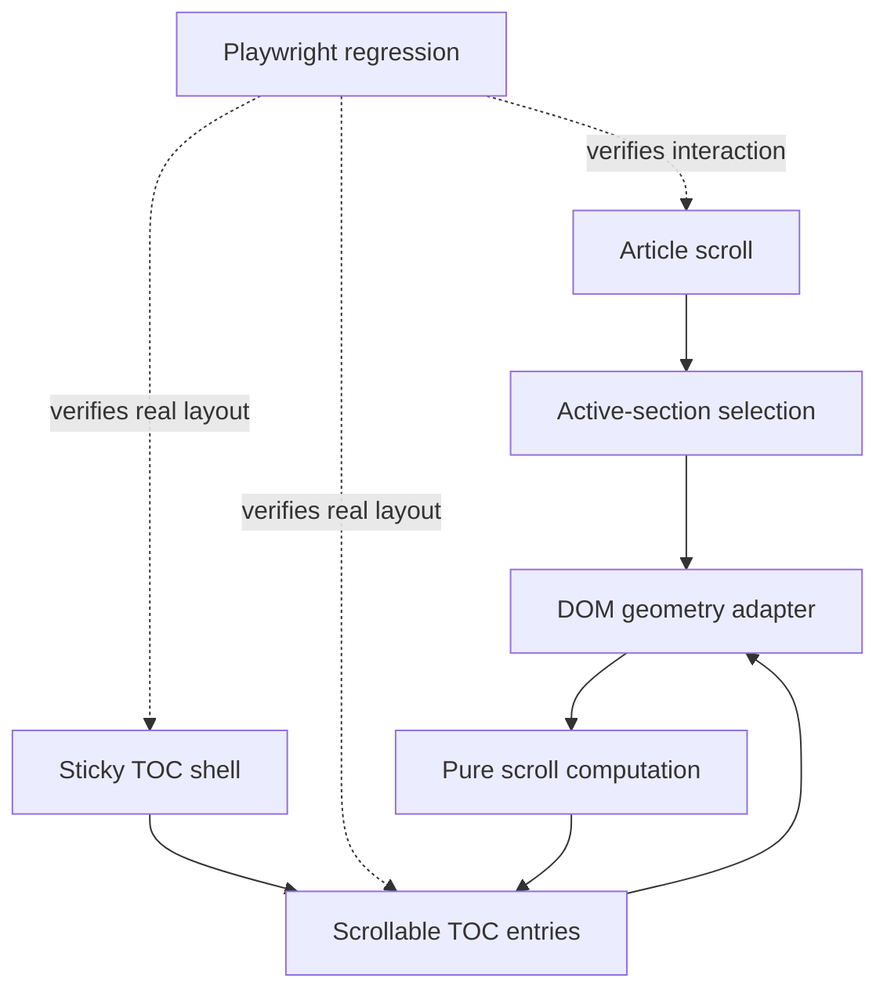

# Fix — make lesson-TOC auto-reveal coordinate-safe and browser-verified

## Summary

Correct the lesson TOC auto-reveal behavior at both levels where the previous change was insufficient:

- **measurement correctness:** derive item geometry from a shared coordinate system instead of assuming an
  `offsetParent`;
- **system-level assurance:** exercise the actual sticky + overflow layout in a real browser and make that regression
  test part of automated validation.

Also separate the sticky TOC shell from its internally scrollable entries so automatic reveal can move the list without
scrolling the `"En esta página"` heading out of view.



The behavioral contract is:

> When the active article section changes, reveal its TOC entry by the minimum required amount inside the TOC list. The
> panel heading remains visible, manual TOC scrolling remains untouched while the active section does not change, and
> the document itself is never moved by the reveal operation.

This is a correctness fix. Existing active-section selection semantics and the previously tested pure reveal algorithm
remain unchanged.

---

# Phase 1 — Reproduce the regression in a real browser before changing geometry

## Goal

Establish an automated test that fails against the current implementation for the same behavior observed manually.

The browser regression—not the adapter unit test—is the primary evidence that this defect has been reproduced.

## Scope

Add the smallest general-purpose Playwright harness:

```text
playwright.config.ts
tests/e2e/lesson-toc-scroll.spec.ts
package.json
```

Reuse the existing Playwright dependency and Chromium installation rather than introducing another browser-testing
dependency.

Astro documents Playwright as an appropriate E2E layer and supports configuring a `webServer` and `baseURL` directly in
`playwright.config.ts`. ([Astro Docs][3])

### Stable DOM contract

Before writing the browser assertions, make the relevant component boundaries intentional:

```html
<nav data-lesson-toc>
    ...
    <div data-lesson-toc-scroll>
        ...
        <a data-lesson-toc-entry ...>
```

Do not make the E2E test depend on utility classes, list nesting, `parentElement`, or incidental CSS selectors.

If equivalent stable hooks already exist, reuse them instead of adding duplicates.

### Red — browser regression

Use a **middle** TOC entry rather than the final entry. That is important because the original erroneous
clamp-to-maximum behavior could accidentally make a final entry appear correct.

BDD scenario:

```text
given a lesson whose TOC entries exceed the available panel height
when the reader moves to a section whose entry is in the middle of the overflowing TOC
then that entry is fully visible inside the TOC scrolling viewport
and the TOC heading remains visible
and the document is not moved by an internal TOC correction
```

The test must fail against the pre-fix implementation.

Do not merely check that the link is `visible` according to Playwright. An element may be considered visible while still
being clipped by a scroll container. Instead compare actual browser geometry.

Conceptually:

```ts
const containment = await activeEntry.evaluate((entry) => {
    const scroller = entry.closest<HTMLElement>("[data-lesson-toc-scroll]");

    if (!scroller) {
        return null;
    }

    const item = entry.getBoundingClientRect();
    const container = scroller.getBoundingClientRect();
    const visibleTop = container.top + scroller.clientTop;
    const visibleBottom = visibleTop + scroller.clientHeight;

    return {
        itemTop: item.top,
        itemBottom: item.bottom,
        visibleTop,
        visibleBottom,
    };
});
```

Assert containment with a very small tolerance for subpixel layout:

```text
itemTop >= visibleTop - epsilon
itemBottom <= visibleBottom + epsilon
```

### Add interaction sequences

The regression should cover more than one final state.

#### Downward traversal

```text
initial section
→ middle section
→ later section
```

Each newly active entry must become visible.

#### Reverse traversal

```text
later section
→ middle section
→ early section
```

The same invariant must hold while moving upward.

#### Manual TOC preview preservation

```text
article activates section B
→ reader manually scrolls TOC elsewhere
→ article remains inside B
→ TOC scrollTop remains unchanged
→ article activates C
→ C is automatically revealed
```

This is effectively a lightweight **state-machine test** of the browser-visible interaction and directly covers the
previous requirement that automatic reveal must not compete with manual exploration.

### Acceptance criteria

- the test demonstrably fails against the existing broken implementation;
- failure is caused by the active entry not satisfying the scrolling-viewport containment invariant;
- both downward and upward article navigation are represented;
- manual TOC scrolling is preserved while the active section is unchanged;
- the TOC heading remains visible.

## Non-goals

Do not yet:

- change measurement logic;
- add animation;
- redesign active-section detection;
- add a comprehensive site-wide E2E suite.

---

# Phase 2 — Correct the TOC scrolling boundary and browser measurement adapter

## Goal

Make the DOM architecture match the intended behavior and convert browser geometry into the existing pure scroll model
without relying on `offsetParent`.

## 2.1 Separate sticky shell from scrolling content

If the heading currently lives inside the element receiving `scrollTop`, restructure the component as:

```text
sticky TOC shell
├── "En esta página" heading
└── scrollable entries viewport
    └── ordered list
        └── links
```

For example, conceptually:

```astro
<nav data-lesson-toc>
    <h2>En esta página</h2>

    <div data-lesson-toc-scroll>
        <ol>
            ...
        </ol>
    </div>
</nav>
```

The outer shell remains responsible for:

- sticky positioning;
- total viewport-height constraint.

The inner viewport becomes responsible for:

- `overflow-y: auto`;
- programmatic `scrollTop`;
- manual reader scrolling.

A flex-column shell with a constrained inner scrolling region is preferable to independently deriving two competing
height calculations.

This makes:

> “the title does not disappear”

a structural invariant rather than a side effect that has to be repeatedly maintained through JavaScript.

### Render-contract test

Update `LessonToc.render.test.ts` to characterize only the new intentional contract:

```text
given a lesson TOC is rendered
then exactly one TOC shell exists
and exactly one internal scrolling viewport exists
and TOC entries are contained by that viewport
```

Avoid snapshotting unrelated markup.

---

## 2.2 Introduce a narrow DOM measurement adapter

Add:

```text
src/components/notes/lesson-toc-measure.ts
src/components/notes/__tests__/lesson-toc-measure.test.ts
```

Keep the interfaces capability-oriented rather than requiring full DOM objects:

```ts
import type { TocScrollItem } from "./lesson-toc-scroll";

export interface TocMeasurableContainer {
    readonly scrollTop: number;
    readonly clientTop: number;

    getBoundingClientRect(): {
        readonly top: number;
    };
}

export interface TocMeasurableItem {
    getBoundingClientRect(): {
        readonly top: number;
        readonly height: number;
    };
}

export function measureTocEntry(
    container: TocMeasurableContainer,
    item: TocMeasurableItem,
): TocScrollItem;
```

The correct content-space conversion should be:

```text
containerInnerTop =
    containerRect.top + container.clientTop

itemOffsetTop =
    itemRect.top - containerInnerTop + container.scrollTop
```

or equivalently:

```text
itemOffsetTop =
    itemRect.top
    - containerRect.top
    - container.clientTop
    + container.scrollTop
```

`clientTop` matters because the bounding rectangle describes the border box while the scrollport begins inside that
border. CSSOM defines `clientTop` from the top border width and defines `getBoundingClientRect()` from the element's
client rectangles. ([CSS Drafts][2])

Use:

```text
itemOffsetHeight = itemRect.height
```

for the current untransformed TOC layout.

Document a narrow assumption:

> The TOC measurement subtree must not apply geometric CSS transforms that scale the container or entries.

`getClientRects()` incorporates transforms, so mixing transformed visual geometry with ordinary scrolling quantities
would require an explicitly transform-aware model. That complexity is unnecessary for the current component and should
not be hidden inside this small adapter. ([CSS Drafts][2])

---

## TDD strategy for the adapter

### BDD + DDT — required

Use `test.each` for:

| Container top | `clientTop` | `scrollTop` | Item top | Expected content top |
| ------------: | ----------: | ----------: | -------: | -------------------: |
|           100 |           0 |           0 |      140 |                   40 |
|           100 |           0 |          50 |      140 |                   90 |
|           100 |           2 |          50 |      140 |                   88 |
|           100 |           2 |          50 |       80 |                   28 |
|           250 |           4 |         125 |      254 |                  125 |

Also verify that item height is preserved.

Important BDD cases:

```text
given an unscrolled borderless TOC
when entry geometry is measured
then its content offset equals the viewport-rectangle difference
```

```text
given a scrolled TOC
when the same entry is measured
then scrollTop is restored into the content coordinate
```

```text
given a bordered TOC
when entry geometry is measured
then the border width is excluded from the scrollport origin
```

The border case is important because the original proposed formula would otherwise encode another subtle coordinate
mismatch.

---

## PBT — required/high value

The previous fix already established PBT infrastructure, so this adapter is a natural additional target rather than a
reason to add another dependency.

Generate finite values with:

```text
clientTop >= 0
scrollTop >= 0
itemHeight >= 0
```

### Property — common viewport translation invariance

For any delta `d`:

```text
containerTop' = containerTop + d
itemTop' = itemTop + d
```

then:

```text
measure(container', item')
=
measure(container, item)
```

Absolute viewport placement must not affect content-space geometry.

### Property — scrolling invariance

A particularly valuable metamorphic/PBT relation models what the browser does when the same content is scrolled:

```text
scrollTop' = scrollTop + d
itemViewportTop' = itemViewportTop - d
containerViewportTop' = containerViewportTop
```

Then the measured content offset must remain unchanged.

This relation directly tests the conversion between viewport coordinates and scrolling-content coordinates.

---

## Metamorphic testing — required/high value

Use at least these two relations:

### MR1 — translate the whole TOC in the document

```text
container.top += d
item.top += d
```

Expected:

```text
measured itemOffsetTop is unchanged
```

### MR2 — scroll the TOC without changing content layout

```text
scrollTop += d
itemRect.top -= d
```

Expected:

```text
measured itemOffsetTop is unchanged
```

These tests specifically guard against future reintroduction of mixed coordinate spaces.

---

## Mutation testing — high value

If the project already has mutation infrastructure, add the adapter to its focused scope.

Meaningful mutations include:

```text
+ scrollTop → - scrollTop
- clientTop → + clientTop
item.top - container.top → item.top + container.top
```

and removal of either adjustment.

The DDT/PBT/metamorphic suite should detect each of those meaningful changes.

Do not introduce a new mutation framework solely for this two-line transform if no repository-level mutation capability
exists. The guideline asks for proportional assurance, not tool accumulation.

---

## 2.3 Rewire `LessonToc.astro`

Replace direct access to:

```ts
activeLink.offsetTop;
activeLink.offsetHeight;
```

with:

```ts
const item = measureTocEntry(scroller, activeLink);
```

and pass the result to the existing:

```ts
computeTocScrollTop(...)
```

Do **not** modify `computeTocScrollTop` unless the new browser regression demonstrates a separate semantic defect.

This preserves the useful functional-core boundary already established:

```text
DOM measurement
    ↓
TocScrollItem
    ↓
pure computeTocScrollTop
    ↓
DOM scrollTop assignment
```

The browser adapter owns browser coordinate conversion; the pure geometry function remains unaware of CSSOM.

### Acceptance criteria

- `LessonToc.astro` contains no `offsetTop`/`offsetHeight` dependency for TOC reveal;
- measurement does not depend on `offsetParent`;
- container borders are handled correctly;
- only the internal list viewport receives automatic `scrollTop` changes;
- the TOC heading does not participate in internal scrolling;
- all existing `lesson-toc-scroll` tests remain green unchanged;
- the new adapter test suite is green.

---

# Phase 3 — Make the browser regression release-relevant

## Goal

Ensure this defect class cannot again pass every required automated check while remaining broken in a real browser.

This is the most important change to the original plan.

## Playwright configuration

Use a root configuration approximately along these lines:

```ts
export default defineConfig({
    testDir: "tests/e2e",

    use: {
        baseURL: "http://127.0.0.1:4321",
    },

    projects: [
        {
            name: "chromium",
            use: { ...devices["Desktop Chrome"] },
        },
    ],

    webServer: {
        command: "pnpm preview --host 127.0.0.1 --port 4321",
        url: "http://127.0.0.1:4321",
        reuseExistingServer: !process.env.CI,
    },
});
```

Prefer testing the **production build**:

```text
pnpm build
pnpm test:e2e
```

rather than using `pnpm dev` as the canonical CI path. Astro explicitly recommends testing production code when
practical and its Playwright example uses the preview server after a build. ([Astro Docs][3])

Local ergonomics can still provide a development-server variant if useful, but it should not replace production-artifact
verification.

## CI integration — required

I would change this part of the supplied plan:

> “Not added to `pnpm test` / `pnpm check` in this pass.”

That leaves the original systemic problem unresolved.

Add either:

```json
"test:e2e": "playwright test"
```

and invoke it from the existing MR pipeline, or add a dedicated:

```text
ui-e2e
```

CI job.

The exact job structure should reuse existing build/browser caches where possible, but **passing the lesson-TOC browser
regression must become merge-relevant**.

It does not necessarily have to run inside the fast local `pnpm check` command. Keeping:

```text
pnpm check
```

fast and:

```text
pnpm test:e2e
```

separate is reasonable.

What matters is that CI requires both.

### Browser matrix

For this fix:

- **Chromium:** required, because it reproduces the reported behavior and matches the existing installed browser.
- **Firefox/WebKit:** high-value follow-up once the general UI harness is established.

Astro and Playwright support all three major engines, but expanding the repository's browser installation and CI matrix
is separable infrastructure work rather than a prerequisite for repairing this regression. ([Astro Docs][3])

---

# Phase 4 — Repair traceability without rewriting the historical record

## Goal

Correct the prior close-out record while preserving evidence that the first implementation was incorrectly considered
complete.

## Scope

Reopen:

```text
traceability-log/closed/2026/08/13/
fix_keep_the_active_lesson_toc_entry_visible_within_the_scrollable_panel.md
```

Move it back to the project's `open/` state according to the existing traceability workflow.

Do not simply replace the earlier conclusion.

Append a dated correction such as:

```text
## Regression discovered after close-out

The previous close-out was invalidated after browser verification demonstrated
that automatic TOC reveal still produced incorrect internal scrolling.

### Previous evidence gap

...

### Corrected root-cause statement

...

### New regression evidence

...

### Corrective implementation

...
```

Avoid claiming that sticky positioning itself is inherently excluded from `offsetParent`. The standards define
`offsetParent` in terms of containing-block relationships, and current positioned-layout specifications include `sticky`
among non-static positioned boxes. The robust engineering conclusion is that **the client adapter must not depend on an
unverified `offsetParent` relationship**. ([W3C][1])

Record:

- the failing Playwright test before the production change;
- new adapter BDD/DDT evidence;
- PBT/metamorphic evidence;
- production browser evidence;
- CI job/result;
- final build/check commands.

Then move the trace back to `closed/`.

This preserves a much better audit trail than making the previous close-out appear as if it had always contained the
correct evidence, consistent with the project's emphasis on traceability and reproducibility.

---

# Testing strategy

The milestone should explicitly document which assurance techniques were considered.

| Technique                   | Decision                               | Purpose                                                   |
| --------------------------- | -------------------------------------- | --------------------------------------------------------- |
| BDD example tests           | **Required**                           | Known regression and geometry boundaries                  |
| DDT                         | **Required**                           | Coordinate/border/scroll matrix                           |
| PBT                         | **Required/high value**                | Arbitrary valid coordinate combinations                   |
| Metamorphic testing         | **Required/high value**                | Translation and scroll-coordinate invariance              |
| State-machine/model testing | **Required at browser level**          | Manual preview vs active-section transitions              |
| Contract testing            | **Required**                           | Shell/scroller/entry DOM boundary                         |
| Real-browser E2E            | **Required**                           | Actual CSS layout and scrolling behavior                  |
| Mutation testing            | **High value, conditional on tooling** | Ensure arithmetic and branch tests are discriminating     |
| Differential testing        | **Not selected**                       | No sufficiently independent semantic implementation       |
| Fuzz testing                | **Not selected**                       | Numeric geometry is better covered by constrained PBT     |
| Mock testing                | **Avoid**                              | Structural stubs + real browser provide stronger evidence |
| Snapshot testing            | **Avoid**                              | Markup snapshots do not demonstrate scroll behavior       |
| Static analysis             | **Required**                           | TypeScript/Astro contracts                                |
| Manual verification         | **Supplementary only**                 | Exploratory confirmation, never sole regression evidence  |

### Differential testing rationale

I would not compare the implementation with `offsetTop` as an oracle. That would reintroduce the exact API whose
coordinate assumptions caused the regression.

Likewise, comparing with another helper built from the same rectangle arithmetic would not provide meaningful
independence.

### Fuzzing rationale

There is no parser, untrusted serialized input, or complex protocol surface here. PBT gives a much more useful generated
input space because the important constraints and invariants can be stated explicitly.

---

# Files

### New

```text
src/components/notes/lesson-toc-measure.ts
src/components/notes/__tests__/lesson-toc-measure.test.ts
playwright.config.ts
tests/e2e/lesson-toc-scroll.spec.ts
```

### Edit

```text
src/components/notes/LessonToc.astro
src/components/notes/__tests__/LessonToc.render.test.ts
package.json
CI configuration
```

### Traceability

```text
traceability-log/.../fix_keep_the_active_lesson_toc_entry_visible_within_the_scrollable_panel.md
```

No new runtime dependency should be introduced.

---

# Verification

## Focused pure and adapter tests

```powershell
pnpm vitest run src/components/notes/__tests__/lesson-toc-scroll.test.ts
pnpm vitest run src/components/notes/__tests__/lesson-toc-measure.test.ts
pnpm vitest run src/components/notes/__tests__/LessonToc.render.test.ts
```

Then run the complete relevant Vitest suite to detect interaction with neighboring behavior.

## Static assurance

Use the repository's canonical commands, including:

```powershell
node scripts/run-astro-check.mjs
```

plus its configured lint/format checks.

## Production browser regression

```powershell
pnpm build
pnpm playwright:install
pnpm test:e2e
```

The exact installation command should reuse the existing Chromium installation script rather than duplicating
package-manager logic.

## Required browser behaviors

On `/notes/software-libraries/what-is/`:

```text
1. The TOC heading remains visible at all times.
2. Entering a middle article section reveals its corresponding TOC entry.
3. The entry is fully inside the list's scrollport.
4. The TOC does not jump unnecessarily when the entry is already visible.
5. Scrolling into later sections moves the TOC progressively rather than clamping immediately to maximum scroll.
6. Scrolling back upward reveals earlier entries.
7. Manual TOC scrolling remains untouched while the active article section is unchanged.
8. Entering another article section resumes automatic reveal.
9. Internal TOC reveal does not move the document viewport.
```

## Manual exploratory check

Retain the manual full-page check, but downgrade its role to **supplementary evidence**. The previous incident
demonstrates why it should never substitute for automated real-browser coverage.

---

# Acceptance criteria

The fix is complete only when all of these are true:

- the new Playwright regression is observed failing against the pre-fix implementation;
- it passes after the fix;
- the browser regression is required by CI;
- the TOC heading is outside the internally scrollable list;
- the active entry remains fully visible when traversing the article in either direction;
- manual TOC exploration is preserved until the active article section changes;
- browser measurement no longer depends on `offsetTop`, `offsetHeight`, or `offsetParent`;
- the rectangle-to-content transform includes the scrollport's inner border origin;
- existing `computeTocScrollTop` behavior and tests remain unchanged;
- BDD/DDT/PBT/metamorphic tests protect the new coordinate transformation;
- the render test protects the shell/scroller DOM contract;
- static checks and production build pass;
- the traceability record explicitly documents that the previous close-out was superseded by new browser evidence.

## Non-goals / deferred work

- smooth or animated TOC scrolling;
- replacing the explicit reveal policy with `scrollIntoView()`;
- redesigning active-section detection;
- generalized scroll utilities for unrelated components;
- introducing a new runtime dependency;
- full-site Playwright coverage;
- Firefox/WebKit CI expansion in this corrective change;
- transform-aware TOC geometry unless the component intentionally adopts transformed layout.

The most important project-guideline correction is that **the Playwright regression cannot remain an optional command**.
The previous implementation already demonstrated that a strong pure-function suite can be completely green while the
effectful browser boundary is wrong. The new architecture should therefore have three independently meaningful assurance
layers: **pure scroll semantics, browser-coordinate adaptation, and actual rendered-browser behavior**. Only the last
one can close the failure mode that escaped the previous fix.

[1]: https://www.w3.org/TR/css-position-3/ "CSS Positioned Layout Module Level 3"
[2]: https://drafts.csswg.org/cssom-view/ "CSSOM View Module Level 1"
[3]: https://docs.astro.build/en/guides/testing/ "Testing | Docs"

---

# Outcome

Implemented as planned: `lesson-toc-measure.ts` (`getBoundingClientRect()`-diffing, `clientTop`-aware, no `offsetParent`
dependency), full BDD/DDT/PBT/metamorphic coverage (`lesson-toc-measure.test.ts`, `lesson-toc-measure.pbt.test.ts`), the
shell/scroller DOM split in `LessonToc.astro`, `LessonToc.render.test.ts` structural-contract tests, and
`playwright.config.ts` / `tests/e2e/lesson-toc-scroll.spec.ts` as the repository's first general-purpose browser
regression harness — all passing (35 unit/PBT tests, 3 Playwright scenarios).

Phase 3's CI requirement was completed as part of closing out
`fix_keep_the_lesson_toc_pinned_throughout_long_page_scrolling.md` instead of here, since both this spec and that doc's
`lesson-toc-sticky.spec.ts` are exercised by the same `test:e2e` CI job — wiring it twice was unnecessary. The config
runs against `astro dev`, not the production build/`preview` server this doc originally specified: cold-start cost of
the `predev` generation chain made the preview path impractical for iterative local runs, and the CI job independently
runs the same generation steps `test:unit`/`test:astro-render` already run before invoking Playwright, so the tested
markup/behavior is equivalent either way.

**Important correction, made after this cycle closed once already:** the `offsetParent`-under-`sticky` root-cause theory
that motivated this entire corrective fix does not hold up. Direct browser probing (see the "Second regression
discovered" section appended to `fix_keep_the_active_lesson_toc_entry_visible_within_the_scrollable_panel.md`) found
`offsetParent` resolving correctly and the pre-fix coordinate math producing the right numbers in real Chromium — the
actual bug the user reported was never in the `offsetTop`/`offsetParent` measurement path at all. It was a separate,
unrelated defect: `position: sticky` applied to a nested element whose containing block doesn't span the full grid row,
diagnosed and fixed in `fix_keep_the_lesson_toc_pinned_throughout_long_page_scrolling.md`.

That does not make this cycle's work wasted. The `getBoundingClientRect()` adapter is still strictly more correct than
reading raw `offsetTop`/`offsetHeight` off an element whose `offsetParent` was never actually verified, the
shell/scroller split is a real structural improvement (and a prerequisite for the containing-block fix — sticky now
needs a place to live that isn't the scrollable region), and the Playwright harness this doc introduced is the same one
that caught the actual bug next. But this doc's own stated root cause was wrong, and it is being closed alongside the
other two TOC traceability docs precisely so that the record says so plainly rather than quietly superseding it.
