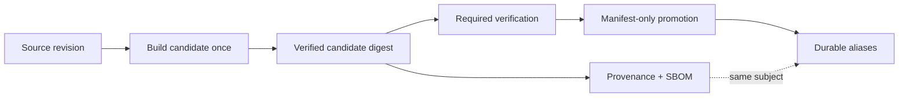
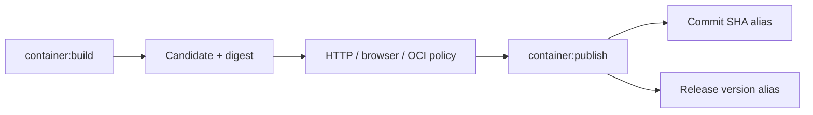

# Milestone 2 — Evidence-based OCI publication and trustworthy provenance

## Summary

Strengthen the existing OCI publication workflow so that every durable image alias can be traced to **the exact
immutable candidate manifest that passed all mandatory verification**.

The milestone should establish this invariant:



Publication must:

- never rebuild the application;
- never mutate the verified OCI manifest;
- derive provenance metadata from authoritative project/CI sources;
- promote aliases only after all mandatory contracts succeed;
- verify every published alias by resolving it back to the expected digest;
- preserve the provenance/SBOM relationship to the candidate artifact;
- fail closed when release metadata is inconsistent or incomplete.

The current branch already implements the basic candidate → verification → publication structure, so this milestone is
primarily a **contract-hardening and provenance-correction initiative**, not a redesign of the pipeline.

---

## Phase 1 — Make candidate identity a validated domain contract

### Goal

Turn `tmp/oci-candidate.json` from loosely trusted pipeline data into the explicit, versioned handoff contract between
build, verification, and publication.

### Current limitation

`container:build` currently records:

```json
{
    "schemaVersion": 1,
    "image": "...",
    "digest": "...",
    "revision": "...",
    "platform": "linux/amd64"
}
```

but downstream scripts parse it directly without a shared schema or semantic validation.

### Scope

Introduce a small reusable OCI domain boundary, for example:

```text
scripts/lib/oci/
├── candidate-metadata.mjs
├── release-policy.mjs
└── registry-client.mjs
```

Do not create additional modules unless cohesion warrants them.

Reuse the already-installed `zod` dependency rather than introducing a new validation library. The repository currently
has Zod 4 available.

### TDD cycle 1.1 — Candidate metadata schema

**Red**

Add BDD/DDT coverage for:

- valid candidate metadata;
- unsupported `schemaVersion`;
- malformed image reference;
- malformed digest;
- missing revision;
- unsupported platform syntax;
- blank or malformed provenance fields.

**Green**

Define a validated candidate model containing at least:

```text
schemaVersion
image
digest
revision
version
source
platform
```

Use a strict digest contract such as:

```text
sha256:<64 lowercase hexadecimal characters>
```

Do not trust `as` casts or arbitrary JSON values at this boundary.

**Refactor**

Use the same parser in:

- OCI policy verification;
- publication;
- future provenance checks.

### TDD cycle 1.2 — Record authoritative build metadata once

Move metadata resolution into the candidate build rather than recalculating it independently during publication.

The candidate should record:

- `revision` from `CI_COMMIT_SHA`;
- `source` from `CI_PROJECT_URL`;
- `version` from the authoritative project version;
- `platform` from the CI build target;
- candidate image reference and digest.

The current `package.json` version is `0.22.0`, and the changelog uses the same SemVer versioning model.

### Acceptance criteria

- All downstream OCI scripts consume the same validated metadata type.
- Unsupported metadata versions fail explicitly.
- Digest syntax is validated before network access.
- Revision, version, source, and platform are captured at build time.
- Publication does not independently invent a second interpretation of candidate metadata.

### Non-goals

- changing image contents;
- changing registry topology;
- introducing an external metadata database.

---

## Phase 2 — Correct and verify OCI provenance metadata

### Goal

Make OCI labels accurately describe the repository revision and release represented by the candidate.

### Current limitations

The Dockerfile currently hard-codes:

```text
org.opencontainers.image.source=https://github.com/r8vnhill/dibs-astro
```

which does not identify the GitLab repository being built. It currently receives revision/version through `ARG`, but not
the canonical source URL.

Also correct the assumption in the original plan:

```text
https://gitlab.com/r8nhill/dibs-astro-website
```

should be:

```text
https://gitlab.com/r8vnhill/dibs-astro-website
```

### TDD cycle 2.1 — Source, revision, and version labels

**Red**

Add an OCI metadata contract that fails against the current incorrect `source` label.

**Green**

Introduce build arguments for provenance metadata, for example:

```text
SOURCE_URL
SOURCE_REVISION
IMAGE_VERSION
```

CI supplies:

```text
SOURCE_URL      ← CI_PROJECT_URL
SOURCE_REVISION ← CI_COMMIT_SHA
IMAGE_VERSION   ← package.json.version
```

For local builds, `SOURCE_URL` may default to the canonical GitLab URL.

Do not use `CI_COMMIT_TAG` as the OCI version merely because a tag exists. `org.opencontainers.image.version` should
describe the project's software version; revision and registry aliases already represent the commit and release
reference separately.

### TDD cycle 2.2 — License-source consistency

The plan should **not yet assert that `BSD-2-Clause` has been validated against the repository's authoritative license
file**.

The current Dockerfile labels the image `BSD-2-Clause`, and the README says the project is BSD 2-Clause, but the README
links to `./LICENSE` while the current root tree contains no such file.

Treat this as a correctness prerequisite:

1. identify the intended authoritative project-license source;
2. if the root license file was unintentionally omitted, restore the canonical license artifact;
3. otherwise update documentation/metadata to point to the actual authoritative source;
4. only then make `org.opencontainers.image.licenses` part of the enforced OCI metadata contract.

Do not infer licensing solely from the existing Docker label.

### Metadata contract

Verify at least:

| Field                               | Expected authority                             |
| ----------------------------------- | ---------------------------------------------- |
| `org.opencontainers.image.source`   | `CI_PROJECT_URL` / canonical GitLab repository |
| `org.opencontainers.image.revision` | full `CI_COMMIT_SHA`                           |
| `org.opencontainers.image.version`  | `package.json.version`                         |
| `org.opencontainers.image.licenses` | authoritative project license metadata         |
| platform                            | candidate metadata / OCI descriptor            |

### Acceptance criteria

- The old GitHub source URL no longer appears in published image metadata.
- Revision uses the full commit SHA.
- Version agrees with `package.json.version`.
- License metadata is validated against an actual authoritative repository artifact.
- Candidate metadata and OCI configuration agree.
- Metadata tests inspect the built OCI artifact, not merely Dockerfile text.

---

## Phase 3 — Make release policy pure and explicit

### Goal

Separate **which aliases are permitted** from **how a registry manifest is copied**.

### Current limitation

`promote-oci-digest.mjs` currently mixes:

- environment interpretation;
- package-version loading;
- alias selection;
- registry authentication;
- manifest retrieval;
- manifest publication.

That makes the most important release rules unnecessarily dependent on live registry I/O.

### TDD cycle 3.1 — Extract release-alias resolution

**Red**

Add data-driven cases for:

- ordinary branch;
- `main`;
- valid release tag;
- tag/version mismatch;
- missing package version;
- malformed SemVer;
- duplicate aliases.

**Green**

Create a pure function approximately equivalent to:

```text
resolvePublicationAliases(context, candidate)
    -> aliases
    | structured failure
```

The result should be deterministic and contain no registry calls.

### TDD cycle 3.2 — Define the tag/version contract

The repository currently has no Git tags, so there is no established tag convention to preserve.

Define one explicitly before release publication becomes canonical.

I would recommend matching the existing package/changelog vocabulary directly:

```text
package.json.version = 0.22.0
release Git tag      = 0.22.0
OCI version alias    = 0.22.0
```

rather than accepting both `0.22.0` and `v0.22.0` implicitly.

If the project prefers `v0.22.0`, encode that instead—but choose one canonical grammar and test it.

For a release pipeline:

```text
normalize(CI_COMMIT_TAG) == package.json.version
```

must be true before any durable alias is written.

### Alias policy

A sensible minimum contract is:

**`main`:**

```text
:<full-commit-sha>
```

**release tag:**

```text
:<full-commit-sha>
:<project-version>
```

If the canonical Git tag is exactly the project version, there is no need to issue a redundant third manifest write
merely to satisfy a conceptual “tag alias.”

Do not publish `latest`.

### Acceptance criteria

- Release-policy tests need no registry.
- A malformed or mismatched release tag fails before publication I/O.
- Alias ordering is deterministic.
- Duplicate aliases collapse predictably.
- No alias semantics depend on `CI_COMMIT_SHORT_SHA`.
- The full commit SHA remains the immutable revision-oriented alias.

---

## Phase 4 — Strengthen digest-preserving promotion

### Goal

Prove independently that promotion does nothing except create additional names for the exact candidate manifest.

### Current limitation

The current promotion script fetches the manifest by candidate digest and compares the registry's digest response header
when one is present. It then performs a `PUT` of that manifest body for each alias. It does not currently resolve every
new alias afterward and prove that it maps back to the expected digest.

### TDD cycle 4.1 — Verify the candidate independently

**Red**

Cover:

- expected digest matches candidate bytes;
- metadata digest differs from registry content;
- missing registry digest header;
- remote candidate is unavailable.

**Green**

Do not depend exclusively on `Docker-Content-Digest`.

Fetch the raw candidate manifest bytes and compute:

```text
sha256(raw manifest bytes)
```

locally.

Require:

```text
computed digest == candidate metadata digest
```

If the registry also provides a content-digest header, require that it agrees as an additional check.

This creates an independent oracle rather than trusting the same registry metadata that publication is about to modify.

### TDD cycle 4.2 — Manifest-only promotion

For each permitted alias:

1. fetch candidate by immutable digest;
2. PUT the exact same raw manifest bytes under the alias;
3. GET the alias;
4. compute its manifest digest;
5. require:

```text
alias digest == candidate digest
```

If any alias fails verification, fail the publication job.

Do not invoke:

- `docker build`;
- BuildKit;
- `pnpm build`;
- Astro;
- package installation beyond what the publication script itself requires.

### TDD cycle 4.3 — Make registry access a shared adapter

Both `promote-oci-digest.mjs` and `verify-oci-image-policy.mjs` currently implement their own registry
request/authentication logic.

Consolidate this into one small OCI Registry client used by both.

Keep:

```text
release policy        pure
candidate validation  pure
digest calculation    pure
registry client       effectful boundary
promotion CLI         orchestration
```

This follows the project's functional-core / imperative-shell guidance and removes duplicated authentication/challenge
parsing.

### Acceptance criteria

- Candidate digest is recomputed from raw manifest bytes.
- Missing digest headers cannot silently weaken verification.
- Every durable alias is re-resolved after publication.
- Every alias resolves to exactly the candidate digest.
- No application build occurs during promotion.
- Registry/authentication logic has one implementation.

---

## Phase 5 — Verify attestation continuity by subject digest

### Goal

Prove that provenance and SBOM evidence still describe the promoted artifact.

### Important semantic distinction

Do not model this as “copy attestations to every tag.”

BuildKit attestations are attached to the built artifact, and durable aliases should all resolve to the same subject
digest. Docker documents provenance and SBOM as build attestations associated with the image artifact.
([Docker Documentation][1])

Therefore the invariant is:

```text
candidate subject digest
        ==
promoted alias subject digest
```

and consequently the same build evidence remains associated with the artifact.

### TDD cycle 5.1 — Candidate attestation contract

After `container:build`, verify that the candidate has the expected:

- provenance attestation;
- SBOM attestation.

Validate at least:

- subject/candidate identity;
- source revision;
- source URI where available;
- build platform.

Avoid validating unstable implementation-specific timestamps or ordering.

### TDD cycle 5.2 — Post-promotion association

After aliases are created:

1. prove each alias resolves to the candidate digest;
2. inspect attestations through a registry/tooling path known to support the BuildKit representation;
3. prove the promoted artifact still exposes the same provenance/SBOM evidence.

Do not architect this specifically around the OCI Referrers API: GitLab currently supports OCI 1.1 `subject`
relationships but explicitly notes that its registry does not fully implement the OCI 1.1 Referrers API.
([GitLab Docs][2])

Prefer an attestation-aware inspector supported by the actual build/registry workflow.

### Acceptance criteria

- Candidate provenance and SBOM are present before promotion.
- Promotion creates no second build attestations.
- Durable aliases resolve to the attested candidate digest.
- Post-promotion inspection exposes the expected evidence.
- No secret-valued build input is asserted or printed by the tests.

---

## Phase 6 — Make CI publication explicitly evidence-gated

### Goal

Ensure GitLab encodes the same artifact lifecycle that the scripts enforce.

### Current baseline

`container:publish` already has mandatory `needs` edges to:

- `container:build`;
- HTTP contract;
- browser contract;
- OCI policy;
- ordinary build/check/test jobs.

It also runs only on `main` or tags.

Keep that structure.

### Improvements

Add promotion-specific preconditions:

```text
candidate metadata valid
        ↓
remote candidate digest valid
        ↓
required verification jobs successful
        ↓
release policy valid
        ↓
promotion
        ↓
post-promotion alias verification
        ↓
attestation continuity verification
```

Do not add a second build stage.

### TDD cycle 6.1 — Pipeline graph

Use GitLab CI configuration validation to cover:

- merge-request pipeline: candidate verification, no durable publication;
- ordinary branch: candidate verification according to project policy, no durable publication;
- `main`: verification followed by SHA publication;
- valid release tag: verification followed by release aliases;
- malformed release tag: publication job fails closed.

### Acceptance criteria

- A failure in any required verification prevents promotion.
- Merge requests never create durable aliases.
- Promotion receives the candidate metadata artifact from `container:build`.
- No publication job invokes BuildKit.
- No publication job rebuilds application content.
- Post-publication verification is part of the same job/transactional workflow where practical.

---

# Testing strategy

Use several assurance techniques rather than one large integration test.

### Example-based / BDD

Use for:

- malformed candidate metadata;
- digest mismatch;
- registry failures;
- invalid release context;
- failed alias publication.

### Data-driven testing

Use a matrix for:

```text
branch kind × tag state × package version × expected aliases
```

### Property-based testing

`fast-check` is already available in the repository.

Useful properties include:

- alias resolution is deterministic;
- aliases are unique;
- ordinary branches never produce release aliases;
- valid release contexts always include the full revision alias;
- any tag/version inconsistency yields no publication plan;
- digest parsing accepts only the configured digest algorithm/shape.

### Integration tests

Use an actual OCI registry only for behavior that cannot be established from pure tests:

- authentication;
- manifest GET/PUT semantics;
- digest preservation;
- alias resolution;
- provenance/SBOM association.

Do not turn every unit test into an authenticated registry test.

---

# Documentation

Update `README.md` and `docs/gitlab-runner-setup.md` only where they are authoritative for the changed workflow.

Use Mermaid for the publication flow:



Document:

- candidate versus durable aliases;
- the candidate metadata contract;
- build-once / promote-by-manifest semantics;
- authoritative sources for revision, project URL, version, and license;
- release-tag convention;
- relationship between digest and attestations;
- registry authentication requirements without credential values.

Do not duplicate low-level Registry HTTP implementation details in the README; keep those in maintainer/runbook
documentation.

Do not modify `CHANGELOG.md`.

---

# Required corrections to the original assumptions

1. **Canonical repository:** use `https://gitlab.com/r8vnhill/dibs-astro-website`, not `r8nhill`. The Dockerfile's
   current GitHub source URL must also be corrected.

2. **Version source:** `package.json.version` is currently `0.22.0` and aligns with the changelog's current release
   entry. Keep it authoritative unless a separate release-design change explicitly introduces another source.

3. **Release tags:** there are currently no repository tags, so the tag syntax is not an existing contract. Define it
   explicitly as part of this milestone rather than claiming to preserve one.

4. **License:** `BSD-2-Clause` is asserted by the current Dockerfile/README, but the README's referenced root `LICENSE`
   file is absent from the current tree. Resolve that source-of-truth inconsistency before enforcing the OCI license
   label.

5. **Platform:** keep the Dockerfile platform-neutral. `linux/amd64` remains the initial publication contract,
   represented in candidate metadata and verified against the OCI descriptor. The current CI already records it that
   way.

---

# Final acceptance criteria

Milestone 2 is complete when:

- `tmp/oci-candidate.json` is a versioned, strictly validated handoff contract;
- candidate source, revision, version, and platform come from authoritative sources;
- OCI configuration agrees with candidate metadata;
- the canonical GitLab repository appears in `org.opencontainers.image.source`;
- project-license metadata has an actual authoritative repository source;
- release tag syntax is explicitly defined and tested;
- tag/version mismatches fail before registry mutation;
- the candidate manifest digest is independently recomputed from its bytes;
- registry-reported digest metadata, when present, agrees with the computed digest;
- publication performs only manifest-level registry operations;
- every published alias is fetched again and independently shown to resolve to the candidate digest;
- all durable aliases therefore identify exactly one verified manifest;
- provenance and SBOM evidence are present on the candidate and remain associated with that digest after promotion;
- no second build or second set of build attestations occurs;
- promotion policy can be tested without registry access;
- registry access/authentication logic is shared rather than duplicated across OCI scripts;
- failed HTTP, browser, OCI-policy, metadata, release-policy, or promotion verification prevents durable publication;
- merge requests do not publish durable aliases;
- `main` publishes the full commit-SHA alias only after verification;
- valid releases publish the canonical version alias only after version/tag consistency is established;
- `latest`, image signing, vulnerability scanning, additional registries, and multi-platform publication remain
  deferred;
- documentation reflects the implemented flow;
- `CHANGELOG.md` remains untouched.

The biggest architectural improvement is to make the milestone about **three explicit contracts rather than one large
publication script**: a validated candidate model, a pure release policy, and an effectful OCI registry adapter. That
gives the critical release logic cheap, deterministic tests while reserving authenticated CI for the few properties that
genuinely require a real registry.

[1]: https://docs.docker.com/build/metadata/attestations/sbom/?utm_source=chatgpt.com "SBOM attestations"
[2]: https://docs.gitlab.com/user/packages/container_registry/?utm_source=chatgpt.com "GitLab container registry"
