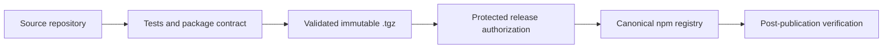

# Improve `npm-packages` as the canonical `@ravenhill` registry

## Goal

Turn `r8vnhill/npm-packages` into a small, auditable **artifact-governance repository** for the `@ravenhill/*` npm
scope.

The repository must clearly separate three responsibilities:

```text
source repository
    source code
    tests
    version
    changelog
    release authorization
    package construction
            │
            │ exact validated .tgz
            ▼
npm-packages
    registry policy
    package ownership
    public distribution
    migration provenance
    governance checks
            │
            ▼
consumers
```

At completion:

- the canonical registry contains the intended package history;
- active packages are publicly retrievable;
- package/source ownership is machine-readable;
- CI proves the checked-in policy agrees with the observable registry;
- the README explains consumption and publication responsibilities;
- GitLab previews expose a useful description, topics, and badges;
- source repositories remain responsible for constructing and publishing their own validated artifacts.

## Explicit non-responsibilities

`npm-packages` must **not**:

- build application/library packages;
- recreate historical packages from source;
- own package versions or changelogs;
- create package-specific GitLab Releases;
- become a monorepo for `@ravenhill/*` source code;
- contain credentials for publishing packages;
- duplicate package-specific test suites.

---

# Phase 1 — Establish the canonical registry and preserve migration evidence

## Goal

Demonstrate that `npm-packages` is actually canonical before documentation or downstream consumers rely on that claim.

## Scope

- existing `@ravenhill/astro-icons` versions;
- original `astro-icons` registry;
- canonical `npm-packages` registry;
- migration provenance;
- anonymous consumer access.

## TDD cycle 1 — Inventory historical artifacts

### Red

Create a data-driven migration test that discovers every historical version of the package from the original registry.

For each version, record:

```text
package name
version
source registry project
archive identity
SHA-256
package.json name
package.json version
```

Do not hardcode the test to `0.1.0` and `0.2.0`; those are current examples, not the migration algorithm.

### Green

Download and preserve the exact published archives.

Add a machine-readable evidence artifact such as:

```text
provenance/
└── astro-icons-registry-migration.json
```

with a versioned schema.

Do not rebuild historical releases from Git tags when the originally published bytes are available.

### Refactor

Separate:

```text
registry I/O
    ↓
observed artifact metadata
    ↓
pure equivalence comparison
```

so digest/name/version comparison can be tested without network access.

---

## TDD cycle 2 — Differential artifact equivalence

### Red

For every migrated version, assert:

```text
original registry archive SHA-256
        =
preserved migration archive SHA-256
        =
canonical registry archive SHA-256
```

Also verify package name/version equivalence independently of the digest.

### Green

Complete any missing migration using the preserved tarballs.

### Testing

This is a strong use of:

- DDT across all versions;
- differential testing between registry locations;
- runtime assertions at the package boundary.

### Acceptance criteria

- every historical version selected for preservation has an evidence record;
- canonical and original artifacts are byte-identical;
- no historical package is reconstructed from source.

---

## TDD cycle 3 — Public consumer contract

### Red

From an isolated environment with:

- no GitLab credentials;
- no user `.npmrc`;
- fresh npm/pnpm cache;

verify each active package through the canonical registry using metadata lookup and tarball retrieval.

Prefer `npm view` plus `npm pack` or equivalent retrieval rather than executing arbitrary package install scripts.

### Green

Correct registry visibility/configuration until public retrieval succeeds.

### Acceptance criteria

- every active package can be queried anonymously;
- every active package archive can be downloaded anonymously;
- the downloaded archive is the artifact already verified by migration evidence.

---

## TDD cycle 4 — Retire competing registry ownership

Only after all preceding evidence is green:

1. confirm maintained consumers use the canonical endpoint;
2. confirm package-forwarding behavior is safe for the cutover;
3. retire obsolete copies from the original project registry;
4. rerun public retrieval and artifact-equivalence checks.

### Acceptance criteria

- only the intended registry is authoritative for future publication;
- existing consumers remain functional;
- migration provenance remains available after old storage is retired.

## Non-goals

- no README redesign yet beyond an interim warning if canonicality is not established;
- no package publication from this repository.

---

# Phase 2 — Define executable registry governance

## Goal

Represent package ownership and lifecycle through a small machine-readable contract that can be reviewed in merge
requests and validated deterministically.

## Repository structure

Keep the repository deliberately small:

```text
npm-packages/
├── README.md
├── LICENSE
├── registry-policy.json
├── registry-policy.schema.json
├── provenance/
│   └── astro-icons-registry-migration.json
├── scripts/
│   ├── verify-policy.mjs
│   ├── verify-registry.mjs
│   └── verify-project-metadata.mjs
├── tests/
│   └── registry-policy.test.mjs
├── docs/
│   └── governance.md
└── .gitlab-ci.yml
```

Prefer built-in platform facilities for the small amount of implementation logic. Introduce a schema-validation
dependency only if it materially reduces custom validation logic; if a JSON Schema validator is added, use it for
structural validation and keep project-specific semantic checks separate.

---

## TDD cycle 1 — Registry policy schema

### Red

Define BDD examples such as:

```text
given an active package
when its policy entry is validated
then its package name belongs to @ravenhill/*
and its source project is explicit
```

Cover:

- one canonical `@ravenhill` scope;
- npm as the supported package type;
- registry project ID/path;
- unique package names;
- unique source mappings where required;
- supported package lifecycle states.

Use an explicit lifecycle:

```text
planned
    declared but not required to exist yet

active
    must exist publicly and may receive new versions

retired
    may remain retrievable for reproducibility but receives no new versions
```

This is more useful long term than a binary active/planned distinction.

### Green

Add a policy such as:

```json
{
    "schemaVersion": 1,
    "scope": "@ravenhill",
    "packageType": "npm",
    "registry": {
        "projectId": 85449745,
        "projectPath": "r8vnhill/npm-packages",
        "publicRead": true
    },
    "packages": [
        {
            "name": "@ravenhill/astro-icons",
            "sourceProject": "r8vnhill/astro-icons",
            "status": "active"
        },
        {
            "name": "@ravenhill/astro-semantics",
            "sourceProject": "r8vnhill/astro-semantics",
            "status": "planned"
        }
    ]
}
```

Treat names above as examples to be reconciled with actual project state.

### Refactor

Keep published versions out of this file.

The taxonomy must remain:

```text
registry-policy.json
    desired governance

GitLab Package Registry
    observed package/version state

provenance/*
    historical migration evidence

source repository
    release authority
```

---

## TDD cycle 2 — Policy semantics

### Red

Use DDT over package statuses:

| Status    |        Must exist in registry | May receive releases |
| --------- | ----------------------------: | -------------------: |
| `planned` |                            No |              Not yet |
| `active`  |                           Yes |                  Yes |
| `retired` | If historical artifacts exist |                   No |

Also verify metamorphic properties:

```text
adding a planned package
must not make the live-registry check require an artifact
```

and:

```text
changing sourceProject
must not change the canonical registry endpoint
```

### Green

Implement the smallest pure policy model necessary to satisfy these rules.

### Acceptance criteria

- malformed policy fails deterministically;
- unsupported lifecycle states fail;
- duplicate package ownership fails;
- package lifecycle semantics have executable coverage.

---

## TDD cycle 3 — Live registry reconciliation

### Red

For every `active` package:

```text
given the checked-in policy
when the canonical public registry is observed
then the package exists
and its metadata belongs to the expected @ravenhill package
and at least one archive is publicly retrievable
```

Also detect packages present in the canonical registry but absent from policy.

Do **not** make `planned` packages fail because they do not yet exist.

### Green

Implement `verify-registry.mjs` as a thin external adapter around the pure policy rules.

Return structured diagnostics identifying:

```text
package
expected state
observed state
reason
```

rather than a generic process failure.

### Acceptance criteria

- every active package is observable;
- undeclared packages are reported;
- planned packages may legitimately be absent;
- network code remains separate from policy logic.

---

# Phase 3 — Establish read-only CI and project-governance evidence

## Goal

Continuously verify the responsibilities that actually belong to this repository without turning it into another
publisher.

## CI topology

Use distinct jobs according to determinism and external dependencies:

```text
verify-policy
    deterministic
    no network
        │
        ▼
verify-provenance
    deterministic
    migration evidence
        │
        ▼
verify-registry
    live GitLab contract
        │
        ▼
verify-project-metadata
    live project configuration where observable
```

### `verify-policy`

Run on every branch and merge request.

Check:

- policy schema;
- policy semantic invariants;
- migration-manifest structure;
- script/static checks.

### `verify-registry`

Run:

- when registry-policy/provenance changes;
- on `main`;
- on a schedule.

This provides early feedback without making every unrelated Markdown change depend unnecessarily on GitLab registry
availability.

### `verify-project-metadata`

Check publicly observable project settings such as:

- description;
- expected topics;
- project visibility;
- Package Registry availability;
- protected default branch where observable;
- configured public badges where API access permits it.

For protected configuration that cannot be read with ordinary public/CI credentials, retain a documented maintainer
audit rather than introducing a long-lived secret merely to make the test automatic.

## Hard boundary

No CI job in this repository may:

- upload npm packages;
- recreate tarballs;
- rewrite package versions;
- create package-specific releases.

Those capabilities belong in source repositories.

## Acceptance criteria

- MR CI validates all deterministic policy contracts;
- `main`/scheduled CI validates observable live registry state;
- network outages cannot masquerade as deterministic policy failures;
- the repository contains no publication credential;
- CI is entirely read-only with respect to package artifacts.

---

# Phase 4 — Replace the README and improve public project metadata

## Goal

Make the project's role understandable from GitLab search results, project previews, and the first screen of the README.

This phase is part of the public contract, not cosmetic polish.

## GitLab project metadata

### Description

Use a concise preview-friendly description such as:

> Canonical public GitLab npm registry for `@ravenhill/*` packages. Source repositories own builds, releases, and
> changelogs.

### Topics

Use infrastructure-oriented topics:

```text
npm
package-registry
artifact-governance
gitlab-package-registry
ravenhill
```

Avoid `astro`: the registry scope must not imply that every future package is Astro-specific.

### Badges

Add badges only when they communicate truthful project-level properties.

Recommended:

```text
pipeline · passing
registry · npm
scope · @ravenhill
```

Optional:

```text
public · read
```

Avoid:

- coverage;
- one package version;
- latest package release;
- package-specific compatibility badges.

Those concepts do not have a single meaningful value at registry-project level.

### Avatar

Optional, but useful for GitLab previews. Use a neutral registry/package identity rather than an Astro-specific mark.

---

## README contract

Keep the README concise and route operational detail into `docs/governance.md`.

Suggested structure:

```text
# @ravenhill npm registry

[badges]

Purpose + ownership boundary

## Use the registry
## Available packages
## How publication works
## Add a package
## Governance
## Migration and provenance
## Support
## Repository license
```

### Opening

Make ownership explicit immediately:

> This project is the canonical public GitLab npm registry for packages under the `@ravenhill` scope.
>
> It owns artifact storage and registry governance. Package source code, tests, versions, changelogs, and release
> authorization remain in each package's source repository.

### Consumer setup

Document the canonical scoped configuration:

```ini
@ravenhill:registry=https://gitlab.com/api/v4/projects/85449745/packages/npm/
```

Then show one minimal installation example:

```sh
pnpm add @ravenhill/astro-icons
```

Make explicit that the registry override applies only to `@ravenhill/*`; ordinary packages continue resolving normally.

### Packages

Do not maintain published versions in the README.

Show only package ownership/lifecycle:

| Package                      | Source                     | Status                                   |
| ---------------------------- | -------------------------- | ---------------------------------------- |
| `@ravenhill/astro-icons`     | `r8vnhill/astro-icons`     | Active                                   |
| `@ravenhill/astro-semantics` | `r8vnhill/astro-semantics` | Planned/Active according to actual state |

`registry-policy.json` remains canonical.

If the package list grows enough that manual synchronization becomes error-prone, generate this section from policy. Do
not introduce generation machinery prematurely.

### Publication model

Use a Mermaid diagram rather than an ASCII diagram in the checked-in Markdown:



Emphasize:

> `npm-packages` stores and governs the registry artifact; it does not rebuild the package.

### Adding a package

Document the contract-oriented workflow:

1. add a `planned` policy entry;
2. review it through an MR;
3. configure package-protection and CI job-token authorization;
4. configure the source repository's release pipeline;
5. publish the exact source-repository candidate;
6. verify public retrieval;
7. change the policy state to `active`.

### Support

Distinguish:

```text
package behavior/API issue
    → source repository

registry availability/governance issue
    → npm-packages
```

### License

Add a license for the repository itself.

Explicitly state that this license covers repository-owned configuration/documentation/scripts and does **not** replace
the licenses of packages stored in the registry.

## Acceptance criteria

- GitLab previews show a meaningful description;
- project topics describe registry infrastructure;
- useful project badges are present;
- the default GitLab starter README is fully removed;
- consumers can configure the registry using the README alone;
- package maintainers can understand the ownership/publication model;
- README does not duplicate version inventory maintained by GitLab.

---

# Phase 5 — Verify GitLab governance configuration

## Goal

Ensure the mutable GitLab project settings agree with the checked-in governance contract.

## Maintainer audit

Verify:

- project visibility is public;
- Package Registry is enabled and publicly readable;
- default branch remains protected;
- package-protection rules cover the intended `@ravenhill/*` namespace;
- publication permission is appropriately restricted;
- deletion permission is more restrictive where supported;
- only authorized source projects appear in the CI job-token allowlist;
- source-repository releases use ephemeral CI authentication;
- obsolete publication paths are removed.

Document expected configuration in:

```text
docs/governance.md
```

Clearly label it **expected GitLab configuration**, not executable configuration.

Where the GitLab API and ordinary CI credentials expose a setting safely, add it to `verify-project-metadata.mjs`.

Where they do not, prefer a documented maintainer audit over introducing a privileged long-lived credential solely for
verification.

## Acceptance criteria

- checked-in policy and GitLab configuration agree;
- publication access follows least privilege;
- package consumers require no credentials for public artifacts;
- no secret is committed or embedded in documentation.

---

# Testing strategy

All styles required by the project guidelines are considered, but only techniques with meaningful value should be
introduced.

| Technique                      | Decision                             | Application                                                                 |
| ------------------------------ | ------------------------------------ | --------------------------------------------------------------------------- |
| Example-based / BDD            | **Required**                         | Policy semantics, lifecycle behavior, public consumer contract              |
| DDT                            | **Required**                         | Packages, historical versions, lifecycle states                             |
| PBT                            | **Not justified initially**          | Policy state space is small and enumerable                                  |
| Differential testing           | **Required**                         | Original vs canonical historical artifacts                                  |
| Metamorphic testing            | **Required, lightweight**            | `planned` package absence; source metadata independent of registry endpoint |
| Mutation testing               | **Deferred**                         | Reconsider if policy/reconciliation logic becomes materially more complex   |
| Fuzz testing                   | **Not justified**                    | No custom parser or complex hostile-input boundary                          |
| Mock testing                   | **Minimize**                         | Pure fixtures for policy logic; real public GitLab for integration          |
| Model-based testing            | **Not needed initially**             | Lifecycle is small enough for explicit DDT                                  |
| State-machine testing          | **Source-repository responsibility** | Publication/retry state belongs to publishers                               |
| Contract testing               | **Required**                         | Policy, registry endpoint, package metadata, public retrieval               |
| Snapshot/golden                | **Selective**                        | Migration evidence or normalized diagnostics only                           |
| Concurrency testing            | **Source-repository responsibility** | This repository performs no package writes                                  |
| Deterministic simulation       | **Optional**                         | Useful only if governance decision logic grows                              |
| Static analysis                | **Required**                         | JSON/schema/script validation                                               |
| Symbolic execution             | **Not justified**                    | No complex computational state space                                        |
| Formal specification           | **Not justified**                    | JSON Schema + executable semantic rules are sufficient                      |
| Runtime assertions             | **Required at external boundaries**  | package name/version/digest/project identity                                |
| Sanitizer-style tooling        | **Not applicable**                   | No native-memory boundary                                                   |
| Cross-version testing          | **Required for migration evidence**  | Every preserved historical package version                                  |
| Browser/E2E                    | **Not applicable**                   | Repository exposes no application UI                                        |
| Security/configuration testing | **Required operationally**           | Public read, package protection, allowlist, branch protection               |

The important separation is:

```text
deterministic tests
    policy + provenance correctness

live contract tests
    observable GitLab state

maintainer audit
    privileged GitLab settings

source-repository tests
    package behavior + publication state machine
```

This prevents `npm-packages` from accumulating responsibilities that belong elsewhere.

# Global acceptance criteria

The repository is ready when:

### Canonical registry

- historical artifacts selected for migration have recorded digest evidence;
- active package artifacts are publicly retrievable;
- canonical downloads match preserved migration evidence;
- obsolete competing registry ownership has been retired safely.

### Governance contract

- `registry-policy.json` has a versioned schema;
- every package has an explicit source repository and lifecycle;
- active/planned/retired semantics are executable;
- undeclared canonical-registry packages are detectable.

### CI

- deterministic policy checks run on every MR;
- live registry checks run where appropriate;
- CI performs no package writes;
- no publication credentials are stored here.

### Documentation and metadata

- README explains purpose, consumption, ownership, publication, and support;
- GitLab description is populated;
- useful topics are configured;
- pipeline/registry/scope badges are visible;
- repository license scope is explicit;
- governance expectations are documented.

### Project configuration

- public-read behavior is verified;
- default branch protection is retained;
- package protection and job-token authorization are audited;
- publication and deletion permissions follow least privilege.

# Suggested execution order

```text
preserve historical artifacts
        ↓
prove old/new artifact equivalence
        ↓
prove anonymous canonical consumption
        ↓
retire competing registry storage
        ↓
define registry-policy + lifecycle
        ↓
add deterministic policy tests
        ↓
add live registry reconciliation
        ↓
establish read-only CI
        ↓
replace README
        ↓
configure description + topics + badges
        ↓
document and audit GitLab governance
        ↓
final policy ↔ registry ↔ documentation consistency check
```

The minimum useful vertical slice is:

> **An active package declared in the checked-in policy can be retrieved anonymously from the documented canonical
> endpoint, CI proves that relationship, and a visitor can immediately determine which source repository owns the
> package.**

That is a stronger end state than simply adding documentation and CI: it makes `npm-packages` a small, explicit, and
verifiable governance boundary while preserving the independent release architecture of the libraries it distributes.
