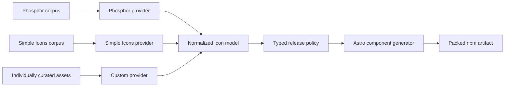
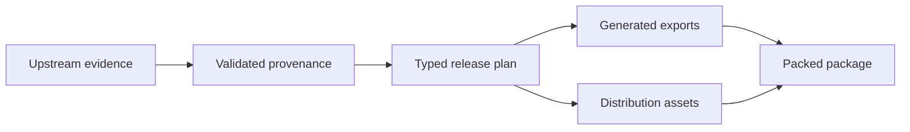
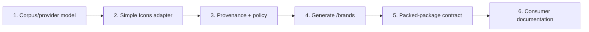

# Add audited brand and developer-tool icons to ``@ravenhill/astro-icons``

## Summary

Extend `@ravenhill/astro-icons` from a Phosphor-focused Astro component package into a **multi-corpus, provenance-aware icon library**.

The first new corpus will use Simple Icons to provide programming-language, build-tool, framework, database, and other technology brand marks such as Kotlin, CSS, Gradle, Docker, GitLab, Python, Scala, and TypeScript.

Preserve the existing public Phosphor API and introduce a new explicit entry point:

```ts
import { ArrowRight } from "@ravenhill/astro-icons";
import { BookOpen } from "@ravenhill/astro-icons/phosphor";

import {
    Gradle,
    Kotlin,
    Python,
} from "@ravenhill/astro-icons/brands";
```

Do **not** expose provider-specific names such as `SiKotlin` or a public `/simple-icons` path. Consumers should depend on the semantic category `brands`; provider provenance remains an internal/release concern.

The intended architecture is:



This should extend, rather than replace, the repository's current policy-driven release model. The existing build already derives generated exports, distribution assets, and package validation from a typed release plan rather than rediscovering publication policy from directories. 

The implementation should follow TDD and preserve all current Phosphor behavior. 

---

# Phase 1 — Establish the multi-corpus domain model and public API

## Goal

Represent Phosphor, brand, and custom icons through one normalized internal model while preserving distinct public namespaces and existing consumer behavior.

## Scope

Extend the current release-model/domain layer to distinguish at least:

```ts
type IconCorpus =
    | "phosphor"
    | "brands"
    | "custom";

type IconProvider =
    | "phosphor"
    | "simple-icons"
    | "project";
```

Keep **corpus** and **provider** separate.

For example:

```text
Kotlin
    corpus   = brands
    provider = simple-icons

ArrowRight
    corpus   = phosphor
    provider = phosphor
```

That distinction matters because a future brand icon may come from another audited provider without changing its public import path.

### Public contract

Extend `package.json#exports` with:

```text
./brands
```

while preserving:

```text
.
./phosphor
./custom
```

The current package explicitly exposes those three existing entry points and treats undeclared subpaths as private API. 

Keep the root barrel behavior unchanged:

```ts
import { ArrowRight } from "@ravenhill/astro-icons";
```

must continue to mean the existing Phosphor API.

Do **not** re-export `/brands` from the root. This avoids collisions between generic pictograms and brand names and preserves the existing root contract.

### Red

Add package-contract tests proving:

```text
given the current published API
when existing Phosphor imports are resolved
then their entry points and export names remain unchanged
```

Add failing tests for the new contract:

```ts
import { Kotlin } from "@ravenhill/astro-icons/brands";
```

from:

1. repository build output;
2. the packed tarball;
3. a representative Astro consumer fixture.

### Green

Introduce the `brands` corpus and public subpath with the minimum generated structure required for one representative test icon.

### Refactor

Move provider-independent vocabulary into the shared release model rather than creating separate Phosphor and Simple Icons implementations of:

* export naming;
* component generation;
* distribution planning;
* package validation.

Keep provider-specific parsing at the ingestion boundary.

## Acceptance criteria

* Existing root and `/phosphor` imports are unchanged.
* `/custom` remains valid.
* `/brands` is the only new public entry point.
* Undeclared provider-specific paths remain private.
* Corpus and provider are represented as distinct concepts.
* The packed tarball, not repository source layout, remains the final public-API oracle.
* Existing Phosphor compatibility tests remain green.

## Non-goals

* adding Devicon;
* changing Phosphor component names;
* aggregating brands into the root barrel;
* exposing provider-specific APIs.

---

# Phase 2 — Add Simple Icons as the first brand provider

## Goal

Consume Simple Icons reproducibly from the package manager and normalize its icon data into the same internal representation used by the existing generation pipeline.

## Dependency strategy

Add `simple-icons` as an **exact development dependency**, not a runtime dependency.

The current Simple Icons package is version `16.28.0`, declares `sideEffects: false`, exposes both icon modules and its structured `icons.json` dataset, and identifies the package license as CC0-1.0. 

Pin the exact version chosen at implementation time and commit the resulting Bun lockfile.

Normal generation must be offline after:

```sh
bun install --frozen-lockfile
```

Do not download SVGs from GitHub, a CDN, or SimpleIcons.org during `generate` or `build`.

### Provider boundary

Introduce a narrow provider abstraction, for example:

```ts
interface IconCorpusProvider {
    readonly id: IconProvider;

    load(): Promise<readonly UpstreamIcon[]>;
}
```

with a provider-neutral representation:

```ts
interface UpstreamIcon {
    readonly provider: IconProvider;
    readonly upstreamId: string;
    readonly title: string;
    readonly viewBox: string;
    readonly body: string;
    readonly provenance: IconProvenance;
}
```

Avoid designing a large plugin framework. Two independent corpora—Phosphor and Simple Icons—are enough to justify extracting the ingestion boundary, but not enough to justify dynamic discovery, lifecycle hooks, or provider registration infrastructure.

### Selection policy

Do **not necessarily publish every Simple Icons brand immediately**.

Make selection an explicit release-plan policy.

For the first vertical slice, start with a representative technology set needed by current consumers, for example:

* CSS;
* Docker;
* Git;
* GitLab;
* Gradle;
* Java;
* JavaScript;
* Kotlin;
* Linux;
* Node.js;
* npm;
* pnpm;
* Python;
* Rust;
* Scala;
* TypeScript.

The exact initial list should come from real consumers rather than this example list.

Store selection as typed data rather than embedding it in generator conditionals.

### Naming

Map upstream slugs to stable Astro exports explicitly:

```text
kotlin      → Kotlin
gradle      → Gradle
typescript  → TypeScript
```

Do not inherit `Si*` naming from Simple Icons.

Public names belong to `astro-icons`; upstream slugs belong to provenance.

### Red

Add DDT for:

* valid upstream icons;
* malformed icon data;
* duplicate upstream IDs;
* two icons mapping to one public export;
* selected icon missing upstream;
* unselected icon remaining absent from public output.

### Green

Implement the Simple Icons adapter and generate the first selected `/brands` components.

### Refactor

Keep transformation stages explicit:


Do not allow component-generation code to know Simple Icons' package structure.

## Acceptance criteria

* Generation requires no network access after frozen dependency installation.
* The exact upstream version is reproducible from the lockfile.
* Only explicitly publishable brand icons enter generated exports and the tarball.
* Upstream removal of a selected icon fails clearly rather than silently removing the public export.
* Export naming is deterministic.
* Collisions fail closed.
* `simple-icons` is absent from consumer runtime dependencies.

## Non-goals

* automatically publishing all 3,000+ upstream brands;
* CDN usage;
* dynamic runtime icon lookup;
* branded colors as component defaults.

Simple Icons currently contains more than 3,400 brand SVGs, so an explicit selection policy also keeps `astro-icons`' package/API surface intentional rather than inheriting an upstream corpus wholesale by accident. ([GitHub][1])

---

# Phase 3 — Extend provenance and redistribution policy per corpus and per icon

## Goal

Ensure a brand icon is publishable only when its upstream identity and redistribution evidence satisfy the same fail-closed standards already applied to Phosphor and custom assets.

This is especially important for Simple Icons: the repository/package is distributed under CC0, but Simple Icons explicitly notes that this does **not** imply every included brand icon is itself CC0, provides per-icon licensing information where available, and warns consumers to consider trademark and brand-guideline requirements. 

Therefore do not model:

```text
provider = Simple Icons
→
all assets = CC0
```

as a release rule.

### Provenance record

Add a provider record such as:

```text
provenance/simple-icons.json
```

containing at minimum:

```json
{
    "schemaVersion": 1,
    "provider": "simple-icons",
    "package": "simple-icons",
    "version": "...",
    "integrity": "...",
    "license": "CC0-1.0"
}
```

Where useful, include a deterministic digest of the relevant upstream dataset.

The current Phosphor workflow already records upstream version, npm integrity information, and asset digests in `provenance/phosphor.json`; preserve that level of traceability for the new corpus rather than introducing a weaker path for brands. 

### Per-icon evidence

Normalize relevant Simple Icons metadata into the release plan, including where available:

* upstream slug;
* title;
* source URL;
* icon-specific license metadata;
* brand-guideline URL;
* selected/excluded state.

Do not make absence of Simple Icons license metadata equivalent to permission or rejection automatically. Simple Icons explicitly states that missing license data does not mean the icon lacks a license and may be incomplete or outdated. 

Instead define the project-local redistribution policy explicitly.

For example:

```text
publishable
excluded-needs-review
excluded-brand-policy
excluded-missing-evidence
```

Use neutral, observable terminology consistent with the project guidelines. 

### License artifact

Preserve the upstream Simple Icons license/disclaimer evidence under `LICENSES/`, with a predictable corpus-specific location.

For example:

```text
LICENSES/
├── phosphor/
├── simple-icons/
│   ├── LICENSE.md
│   └── DISCLAIMER.md
└── custom/
```

Do not rewrite upstream legal text.

### Red

Add contract tests for:

* valid corpus provenance;
* unsupported provider;
* upstream version mismatch;
* missing required provenance;
* unsupported release-decision vocabulary;
* selected icon lacking required project-local redistribution evidence.

### Green

Extend the existing release plan so generation, copied assets, barrels, and packaged files consume the same policy decision.

### Refactor

Do not let generators or pack checks independently reinterpret licenses or provenance.

There should be one pipeline:



## Acceptance criteria

* Every published brand has a provider and upstream identifier.
* Provider provenance records the exact dependency used to generate the corpus.
* Required upstream license/disclaimer artifacts accompany the package.
* Per-icon policy does not incorrectly infer trademark or redistribution rights from the provider's CC0 package license.
* Unsupported or incomplete policy states fail closed.
* Generation and packaging consume one authoritative release plan.

## Non-goals

* legal determination of trademark permission;
* automatic scraping of brand websites;
* silently substituting another provider when an icon becomes unavailable.

---

# Phase 4 — Generalize generated-artifact and package consistency checks

## Goal

Make the existing deterministic-build guarantees apply uniformly across Phosphor, brands, and custom assets.

The repository already checks generated freshness, generated-artifact consistency, packaged files, imports, `publint`, and `arethetypeswrong`; those assurances should remain the backbone of the extension. 

### Red

Add cross-corpus fixtures demonstrating that existing checks currently understand only the prior corpus layout.

Cover:

```text
given each publishable icon in the typed release plan
when generated output and the packed package are inspected
then exactly one matching public Astro component exists
```

Also cover the inverse:

```text
given a generated or packed icon
when it is compared with the release plan
then it corresponds to exactly one planned publishable asset
```

### Green

Generalize:

* generator planning;
* sharded barrels;
* asset copying;
* generated-artifact validation;
* artifact-import checks;
* package-file assertions.

Do not special-case `/brands` in each script independently.

### Refactor

Prefer operations over a collection of release-plan entries:

```ts
for (const icon of releasePlan.publishableIcons) {
    // corpus-independent operation
}
```

rather than:

```ts
processPhosphor();
processBrands();
processCustom();
```

when the behavior is actually identical.

Keep provider-specific behavior only at ingestion and policy boundaries.

### Acceptance criteria

For every corpus:

* each planned public asset has exactly one generated export;
* every generated export belongs to the plan;
* each packaged SVG/component corresponds to a publishable asset;
* excluded assets cannot leak into `dist` or the tarball;
* generated output is deterministic and sorted;
* existing generated-file size constraints remain satisfied;
* `publint`, `attw`, package import checks, and Astro consumer checks pass against the packed artifact.

## Non-goals

* changing the current 500-line generated-file constraint;
* changing ESM-only packaging;
* redesigning the release artifact format.

---

# Phase 5 — Strengthen behavior with DDT, PBT, and differential checks

## Goal

Verify the properties of the new generalized pipeline rather than relying only on selected examples.

### Example-based / BDD

Use focused examples for:

* Kotlin as a representative brand;
* one icon with unusual naming;
* one excluded brand;
* one current Phosphor icon;
* one custom asset.

This proves cross-corpus behavior without duplicating the full corpus in test fixtures.

### Data-driven testing

Run the same contract over every configured corpus:

```text
given a configured icon corpus
when its selected assets are normalized and planned
then all public export names are unique and deterministic
```

Use DDT for:

* corpus/provider combinations;
* publication-policy states;
* export-name edge cases;
* source metadata presence;
* public subpaths.

### Property-based testing

Add a mature Bun/TypeScript-compatible PBT dependency only if the repository does not already have one and the properties justify it.

Useful properties include:

* valid normalized component names are JavaScript identifiers;
* normalization is deterministic;
* export-name mapping is idempotent;
* no two planned icons share `(entryPoint, exportName)`;
* every generated SVG preserves a valid `viewBox`;
* normalization cannot change corpus/provider identity;
* plan → generation → package does not introduce an unplanned icon.

### Differential testing

For the selected Simple Icons corpus, compare the normalized geometry against the installed upstream package independently of the generated Astro component.

This can detect accidental transformation drift:

```text
upstream path geometry
        ↓
normalized representation
        ↓
generated Astro component
```

The oracle should use upstream package data directly, not the same helper that generated the component.

### Security-oriented SVG contract

Because assets are external input, validate at the ingestion boundary that generated SVG bodies contain only the subset the package intends to support.

Reject unsupported active or externally referencing content instead of copying arbitrary SVG markup through to consumers.

Do not build a general-purpose SVG sanitizer unless the upstream representations actually require one; enforce the narrow grammar your generators need.

## Acceptance criteria

* Cross-corpus invariants have DDT coverage.
* High-value normalization invariants have property coverage where worthwhile.
* At least one independent geometry comparison guards the Simple Icons transformation.
* Malformed or unsupported SVG representations fail before generation.
* Tests operate on public behavior and release artifacts rather than private helper call sequences.

This follows the project's stated preference for BDD, DDT, PBT, differential testing, and contract testing where they materially improve assurance. 

---

# Phase 6 — Add provider-aware maintenance workflows

## Goal

Make updating Simple Icons as deterministic and reviewable as the existing Phosphor synchronization process.

The current repository already provides:

```text
icons:check
icons:check-upstream
icons:update
```

and describes Phosphor updates as transactional, with offline read-only checks and an explicit online update operation. 

Do not replace this with a second parallel command family.

### CLI design

Generalize the existing commands around providers:

```sh
bun run icons:check
bun run icons:check-upstream
bun run icons:update simple-icons --dry-run
bun run icons:update simple-icons 16.28.0
```

If preserving the current zero-argument Phosphor workflow is useful for compatibility:

```sh
bun run icons:update phosphor ...
```

can be introduced alongside it without immediately removing existing forms.

### Update plan

A Simple Icons update should report before writing:

* previous/current upstream version;
* selected icons added upstream;
* selected icons removed upstream;
* geometry changes;
* title/slug changes;
* license metadata changes;
* brand-guideline metadata changes;
* selection-policy impact;
* generated public-API additions/removals.

A change to legal/provenance metadata should be visible even when SVG geometry is unchanged.

### Transactionality

Preserve the existing update guarantee:

> if an update cannot complete its provenance, policy, generation, and validation steps coherently, restore the prior repository state.

Do not leave:

* partially updated assets;
* new package version with stale provenance;
* updated provenance with stale generated components.

### Acceptance criteria

* Offline checks remain network-independent.
* Online version discovery is isolated to the explicit upstream-check/update path.
* `--dry-run` makes no repository changes.
* Applied updates change dependency, provenance, evidence, generated output, and lockfile coherently.
* Provider updates are transactional.
* Upstream icon removals cannot silently remove a stable public export without appearing in the update plan.

## Non-goals

* automatically merging upstream updates;
* silently replacing a removed Simple Icons brand with Devicon;
* scheduled auto-publication.

---

# Phase 7 — Document the multi-corpus contract and refine `/custom`

## Goal

Make the expanded library understandable to consumers and maintainers without exposing internal provider machinery as public API.

### README

Document the public taxonomy:

| Path                              | Purpose                                                     |
| --------------------------------- | ----------------------------------------------------------- |
| `@ravenhill/astro-icons`          | Existing root Phosphor API                                  |
| `@ravenhill/astro-icons/phosphor` | Explicit Phosphor corpus                                    |
| `@ravenhill/astro-icons/brands`   | Programming-language, developer-tool, and other brand marks |
| `@ravenhill/astro-icons/custom`   | Individually curated project-maintained assets              |

Redefine `/custom`.

It should no longer mean “anything that isn't Phosphor.”

Use a definition closer to:

> Individually curated icons that are not supplied by an incorporated upstream corpus and whose publication evidence is evaluated independently.

### Brand guidance

Clearly distinguish brand icons from ordinary UI pictograms.

Document that:

* `/phosphor` is appropriate for UI concepts/actions;
* `/brands` represents recognizable technologies or organizations;
* brand geometry should not be modified merely to imitate Phosphor styling;
* Simple Icons provides per-icon licensing/brand-guideline information where available;
* downstream users remain responsible for applicable brand and trademark requirements.

Simple Icons' own disclaimer explicitly asks users to consider individual license and brand-guideline information and notes that package-level CC0 does not settle all rights associated with individual brands. 

### Usage examples

Show:

```astro
---
import { ArrowRight } from "@ravenhill/astro-icons/phosphor";
import { Gradle, Kotlin } from "@ravenhill/astro-icons/brands";
---

<ArrowRight aria-hidden="true" />

<Kotlin
    width={32}
    height={32}
    fill="currentColor"
    aria-label="Kotlin"
/>
```

Do not introduce a package-specific `color` prop if ordinary SVG attributes already express the desired behavior.

### Acceptance criteria

* Consumers can identify the appropriate entry point without knowing provider implementation details.
* Provider provenance remains available to maintainers.
* `/custom` has a narrow, durable meaning.
* Licensing and brand considerations are documented without implying that `astro-icons` grants trademark rights.
* README examples are covered by consumer/package checks where practical.

---

# Suggested execution order

The minimum useful vertical slice should be:



A first merge could support only a small real set—e.g. the icons immediately needed by DIBS—while already using the final architecture.

After that slice is green:

1. generalize update tooling;
2. expand DDT/PBT coverage;
3. grow the curated brand set based on consumer demand.

This is preferable to importing the entire Simple Icons corpus first and only afterward designing provenance, policy, naming, and update semantics.

# Priority

**Required:**

* `/brands` public contract;
* corpus/provider distinction;
* Simple Icons provider;
* exact dependency and offline generation;
* explicit selection policy;
* provider and per-icon provenance;
* license/disclaimer handling;
* generalized release plan;
* packed-artifact verification;
* preservation of existing Phosphor API.

**High-value:**

* provider-aware update tooling;
* DDT across corpora;
* property tests for naming/normalization;
* independent geometry comparison;
* SVG input constraints.

**Deferred:**

* Devicon;
* additional brand providers;
* canonical brand-color metadata API;
* full Simple Icons corpus publication;
* provider fallback;
* runtime icon lookup;
* Iconify compatibility layer.

# Final acceptance criteria

The initiative is complete when:

* existing root and `/phosphor` consumers remain source- and package-compatible;
* `/brands` is a stable explicit public entry point;
* brand consumers do not depend on Simple Icons-specific naming or paths;
* Simple Icons is an exact build-time dependency and normal generation is offline after frozen installation;
* all upstream input passes through a typed provider boundary;
* corpus and provider are separate domain concepts;
* every selected brand has a deterministic `astro-icons` export name;
* duplicate public names fail closed;
* every published brand is represented in the canonical typed release plan;
* Simple Icons package provenance and required upstream legal evidence are recorded reproducibly;
* project policy does not incorrectly treat all individual brand marks as CC0 merely because the Simple Icons package declares CC0-1.0; 
* generated exports, copied assets, and the packed tarball contain exactly the planned publishable icons;
* excluded assets cannot leak into public output;
* `/custom` is restricted to individually curated assets rather than serving as the miscellaneous non-Phosphor namespace;
* `icons:check` remains offline/read-only;
* provider updates support reviewable dry runs and transactional application;
* the packed tarball passes the existing `publint`, `attw`, import, and Astro-consumer checks already used by the package; 
* the README explains corpus selection, brand usage, provenance, and maintenance without exposing internal provider details as public API.

The architecture intentionally makes **adding Devicon later cheap but not automatic**. Devicon offers multiple developer-oriented variants—original/plain/line, colored or uncolored, and wordmarks—which could be valuable for a future requirement, but those variants introduce additional public-policy decisions that Simple Icons does not require for the initial corpus. ([GitHub][2])

That keeps this change aligned with the project guidelines: generalize because a second real provider now exists, but stop before building speculative plugin infrastructure or importing additional dependencies without a demonstrated need. 

[1]: https://github.com/simple-icons/simple-icons?utm_source=chatgpt.com "simple-icons/simple-icons: SVG icons for popular brands"
[2]: https://github.com/devicons/devicon?utm_source=chatgpt.com "devicons/devicon: Set of icons representing programming ..."
