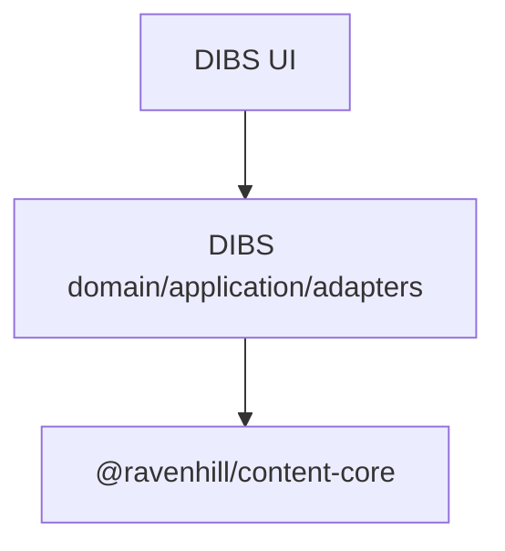
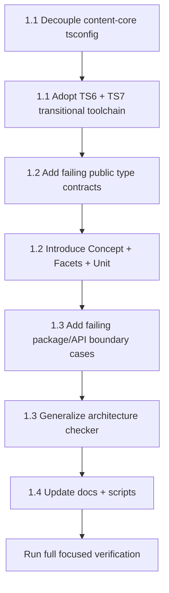

# Milestone 1 — Freeze the Host-Agnostic Curriculum Boundary

## Goal

Establish the smallest coherent, reusable curriculum contract in `@ravenhill/content-core`, modernize its TypeScript
toolchain, and mechanically enforce that the package remains independent from DIBS, Astro, React, routing, rendering,
and graph semantics.

The milestone deliberately introduces **data contracts only**. It does not yet introduce curriculum algorithms.

The intended dependency direction remains:


The existing package is already `private`, exposes only `"."`, and points that root export at `src/index.ts`, so
preserving the root-only API is consistent with its current package contract.

---

# Phase 1.1 — Decouple and modernize the TypeScript boundary

## Goal

Make `@ravenhill/content-core` host-agnostic not only in source vocabulary but also in its compiler configuration, while
moving the repository toward the current TypeScript generation.

## Why this should come first

The current package says it is host-agnostic, but its `tsconfig.json` extends `astro/tsconfigs/strictest` and configures
React JSX.

That means the current abstraction boundary is conceptually neutral but **technically dependent on the website
framework**.

Fix this before adding public curriculum types.

## Scope

### 1. Give `content-core` an independent TypeScript configuration

Replace:

```json
{
    "extends": "astro/tsconfigs/strictest",
    "compilerOptions": {
        "jsx": "react-jsx",
        "jsxImportSource": "react"
    }
}
```

with a framework-neutral configuration.

Prefer explicit library-relevant strictness, including:

```json
{
    "compilerOptions": {
        "strict": true,
        "exactOptionalPropertyTypes": true,
        "noUncheckedIndexedAccess": true,
        "verbatimModuleSyntax": true,
        "module": "ESNext",
        "moduleResolution": "Bundler",
        "target": "ESNext",
        "noEmit": true
    }
}
```

`exactOptionalPropertyTypes` is especially appropriate for public data contracts because it distinguishes an absent
optional property from one explicitly containing `undefined`. ([TypeScript][1])

Do not include:

- JSX;
- DOM libraries unless eventually required by an actual abstraction;
- Astro types;
- React types;
- Vitest globals.

Tests should have their own configuration if necessary.

### 2. Modernize TypeScript using the supported transitional model

The repository currently declares TypeScript `^5.9.2`. TypeScript 7.0 is now stable, but Microsoft explicitly notes that
Astro and other embedded-language ecosystems still need the TypeScript 6 compiler API for their integrated tooling.
Microsoft provides `@typescript/typescript6` specifically to support TS6 and TS7 side by side.
([Microsoft Dev Blogs][2])

I would therefore adopt:

```json
{
    "devDependencies": {
        "@typescript/native": "npm:typescript@^7.0.2",
        "typescript": "npm:@typescript/typescript6@^6.0.2"
    }
}
```

following Microsoft's published transition pattern. ([Microsoft Dev Blogs][2])

Use:

- **TS7** for `content-core` standalone CLI compilation;
- **TS6** where Astro's current tooling needs the compiler API;
- the same public-contract fixture under both compilers as a temporary differential compatibility check.

This gives the reusable package current TypeScript validation without prematurely forcing Astro onto an unsupported
embedded-language configuration. ([Microsoft Dev Blogs][2])

### Red

BDD-style checks:

- `given content-core source, when compiled independently, then no Astro configuration is required`;
- `given content-core source, when compiled with TypeScript 6 and 7, then both accept its public contract`;
- `given an optional metadata property, then omitted and explicitly undefined states follow exactOptionalPropertyTypes semantics`.

### Green

Create the standalone config and introduce the TS6/TS7 side-by-side tooling.

### Refactor

Keep compiler configuration dedicated to this package rather than introducing a premature shared `tsconfig-base`
package.

## Acceptance criteria

- `packages/content-core/tsconfig.json` contains no Astro or React dependency.
- TS7 compiles `content-core`.
- TS6 also accepts its public type surface.
- The existing Astro site still type-checks.
- No runtime dependency is introduced.

## Non-goals

- Astro major-version migration.
- Emission/bundling of `content-core`.
- Publishing to npm.
- Project references unless a concrete build-performance need appears.

---

# Phase 1.2 — Introduce the coherent minimum curriculum model

## Goal

Publish the smallest set of neutral types that can describe a curriculum treatment without encoding DIBS's ontology.

## Scope

Create:

```text
packages/content-core/src/
    curriculum/
        types.ts
    index.ts
```

No internal `index.ts` barrel is necessary yet for a single implementation file.

Keep `src/index.ts` as the **only public package boundary**.

## Improve the proposed model

The original proposal contains:

```ts
conceptIds: readonly string[];
```

but defines no concept entity.

I would avoid publishing a dangling foreign-key concept. Either `conceptIds` needs to disappear until the graph
milestone, or the package needs a minimal concept identity now.

I recommend the latter.

### `CurriculumFacets`

```ts
export type CurriculumFacets = Readonly<
    Record<string, readonly string[]>
>;
```

Keep the generic facet mechanism. Do **not** add:

```ts
CurriculumLanguage;
CurriculumMaterialKind;
PublicationStatus;
```

Those are policies of individual hosts.

### `CurriculumConcept`

```ts
export type CurriculumConcept = Readonly<{
    id: string;
    title: string;
}>;
```

Keep it intentionally minimal.

Do not yet add:

- dependencies;
- prerequisites;
- metadata;
- descriptions;
- language;
- relationships.

### `CurriculumUnit`

```ts
export type CurriculumUnit<Metadata = unknown> = Readonly<{
    id: string;
    title: string;
    conceptIds: readonly string[];
    facets: CurriculumFacets;
    metadata?: Metadata;
}>;
```

`Metadata = unknown` is a good default here.

It means the core may transport host-specific metadata but cannot legitimately inspect it without narrowing.

### Public exports

Use type-only re-exports:

```ts
export type { CurriculumConcept, CurriculumFacets, CurriculumUnit } from "./curriculum/types.js";
```

Type-only exports have no runtime representation, so this milestone does not unnecessarily enlarge the JavaScript
runtime surface. ([TypeScript][3])

## Host usage

A neutral contract test should look like:

```ts
const unit = {
    id: "data-abstraction",
    title: "Data abstraction",
    conceptIds: ["abstraction"],
    facets: {
        level: ["advanced"],
        format: ["lecture"],
        track: ["theory"],
    },
} as const satisfies CurriculumUnit;
```

Using `satisfies` is preferable to a direct annotation for examples like this because it checks compatibility without
discarding the expression's more precise inferred type. ([TypeScript][4])

## Deliberately do not introduce branded IDs yet

Types such as:

```ts
CurriculumConceptId;
CurriculumUnitId;
```

would prevent accidental ID mixing, but genuinely opaque IDs require constructors or assertions and would make this
otherwise declarative API significantly less ergonomic.

Defer nominal IDs until actual relationship algorithms provide evidence that plain strings are insufficient.

## Red

Compile-time BDD cases:

- `given arbitrary facet dimensions, then a curriculum unit accepts them`;
- `given host-specific metadata, then the host can specialize Metadata`;
- `given no metadata, then CurriculumUnit remains usable without a generic argument`;
- `given readonly facet arrays, then no mutable collection is required`;
- `given a concept identifier, then CurriculumConcept provides the corresponding reusable concept entity`.

Use DDT for several facet schemas:

```text
level + format + track
audience + modality
difficulty + module
```

None should refer to programming languages.

### Green

Implement only these three types and root re-exports.

### Refactor

Keep the file small—likely well under 100 lines—and keep documentation close to the public declarations.

## Acceptance criteria

A consumer can represent a curriculum that has:

- no programming languages;
- no web routes;
- no publication state;
- no DIBS concepts;
- arbitrary host-owned metadata.

## Non-goals

No:

- graph;
- relation type;
- validation;
- filtering;
- traversal;
- serialization;
- builders;
- factories;
- runtime schemas.

In particular, **do not introduce Zod here**. The types have no untrusted runtime input yet, so runtime schema
validation would solve a problem the milestone does not have.

---

# Phase 1.3 — Lock the reusable and public API boundaries

## Goal

Turn “host-agnostic” and “root-only API” from documentation promises into machine-checked contracts.

This is where I would strengthen the original plan most significantly.

## Scope

### 1. Consumer-oriented type fixture

Do not test only:

```ts
import type { CurriculumUnit } from "../src";
```

because that bypasses the actual package API.

Instead compile a consumer fixture through:

```ts
import type { CurriculumConcept, CurriculumFacets, CurriculumUnit } from "@ravenhill/content-core";
```

This verifies the actual root export configuration.

TypeScript's own publishing guidance emphasizes that declaration/API structure must match how consumers import the
library. ([TypeScript][5])

Create something like:

```text
packages/content-core/
    tests/
        contract/
            root-api.ts
            tsconfig.json
```

### 2. Negative root-API contract

Verify that this remains unavailable:

```ts
// @ts-expect-error curriculum is intentionally not a public subpath.
import type { CurriculumUnit } from "@ravenhill/content-core/curriculum";
```

Also verify that DIBS-specific names do not exist:

```ts
// @ts-expect-error DIBS policy must not leak into the reusable package.
import type { CurriculumLanguage } from "@ravenhill/content-core";
```

This is stronger than simply searching the source tree for forbidden strings.

### 3. Lock the package export map

Add a small package-contract test asserting that:

```json
"exports": {
    ".": ...
}
```

has **exactly the root entry**.

The package currently has only this root export, so this preserves existing resolution behavior.

Do not modify `typesVersions` in this milestone; changing resolution compatibility deserves a separate
package-publication decision.

### 4. Extend the architecture checker generically

The current architecture checker applies its layer vocabulary to the website's `src/**` tree and explicitly prevents the
domain/application layers from importing packages such as Astro and React.

Rather than creating a one-off `content-core-has-no-astro.test.ts`, generalize the checker to understand reusable
workspace packages.

Add a source classification such as:

```text
content-core
```

with policy approximately:

```text
source:
    packages/content-core/src/**

allowed project targets:
    packages/content-core/src/**

allowed external packages:
    none
```

The important generalization is **allowlisting packages**, rather than continually extending hard-coded
forbidden-package lists.

For existing rules:

```ts
allowedPackages === undefined;
```

preserves current behavior.

For `content-core`:

```ts
allowedPackages: [];
```

means no bare external package import is permitted.

That makes the architecture checker reusable for later extracted packages as well.

### BDD/DDT cases

Use a rule matrix:

| Source                  | Import                    | Expected  |
| ----------------------- | ------------------------- | --------- |
| content-core            | relative internal module  | allowed   |
| content-core            | `astro`                   | rejected  |
| content-core            | `react`                   | rejected  |
| content-core            | `zod`                     | rejected  |
| content-core            | root `src/domain/...`     | rejected  |
| content-core            | type-only external import | rejected  |
| existing website domain | existing valid import     | unchanged |

The checker already recognizes type-only imports as architectural dependencies, so preserve that behavior.

### Red

Add failing architecture/API fixtures first.

### Green

Make the minimal classifier/rule changes required.

### Refactor

Do not special-case individual package names inside the evaluator. Introduce a reusable workspace-package classification
mechanism if the existing structure permits it cleanly.

Keep functions below approximately 25 lines by extracting:

```text
source classification
package-policy evaluation
workspace-root matching
```

rather than enlarging the existing classifier indefinitely.

## Acceptance criteria

- Only the package root resolves publicly.
- All three curriculum types resolve from the root.
- DIBS-specific type names do not resolve.
- `content-core` cannot import Astro, React, Zod, or website source layers.
- Type-only imports are subject to the same boundary policy.
- Existing architecture rules remain behaviorally unchanged.

## Non-goals

Do not introduce a separate architecture-lint dependency such as dependency-cruiser in this milestone.

The repository already has a mature import-extraction and rule-evaluation mechanism; extending it is lower-duplication
than adding a second architecture engine. Its current parser already handles TypeScript, TSX, Astro frontmatter,
re-exports, dynamic imports, and type-only imports.

---

# Phase 1.4 — Align documentation and verification commands

## Goal

Make the new boundary discoverable and ensure the documented verification commands actually correspond to repository
scripts.

## Scope

### `packages/content-core/README.md`

Replace the current “Phase 0 structural proof-of-concept” framing—the README currently still describes the package that
way—with the first real domain contract.

Document:

- host-agnostic purpose;
- concepts versus curriculum units;
- generic facets;
- opaque host metadata;
- root-only package API;
- no runtime validation;
- no graph semantics yet;
- no dependency on Astro/DIBS.

Include at least one example with:

```text
level
format
track
```

rather than programming-language facets.

### `src/index.ts`

Update the package documentation while retaining:

```ts
CONTENT_CORE_PACKAGE_NAME;
CONTENT_CORE_VERSION;
```

unless a later publication milestone decides to replace hard-coded package metadata. Those constants are part of the
current runtime API.

### `docs/architecture/layer-separation.md`

Extend the architecture model:



Explicitly state:

`content-core` owns:

- reusable curriculum data contracts.

DIBS owns:

- `courseStructure`;
- concrete curriculum catalog;
- route resolution;
- concrete facet vocabularies;
- publication state;
- presentation;
- Astro/React;
- eventual graph renderer.

The current architecture already states that domain and application layers should remain independent of framework and
I/O concerns; this change extends that same principle across the package boundary.

### Normalize verification scripts

The current root has:

```json
"check:content-core": "tsc -p packages/content-core/tsconfig.json --noEmit"
```

but does **not** currently define the proposed `test:typecheck:content-core` or `check:architecture` scripts.

Do not document nonexistent commands.

Instead introduce a coherent script hierarchy, for example:

```text
check:content-core:ts6
check:content-core:ts7
check:content-core:api
check:content-core
check:architecture
```

with:

```text
check:content-core
    ├── TS6 compatibility
    ├── TS7 current compiler
    └── public API contract
```

Keep `check:architecture` separate from the global `check` for now if preserving the current fast/default gate is
important. The architecture reference currently documents that wiring it into the default gate is still an explicit
future decision.

## Acceptance criteria

Documentation and executable scripts agree exactly.

A maintainer can answer from the docs:

1. what belongs in `content-core`;
2. what belongs in DIBS;
3. how to consume the root API;
4. how to verify the boundary;
5. what is deliberately deferred.

---

# Testing strategy for this milestone

I would **not try to use every advanced testing technique merely because it exists**.

The state-of-the-art choice is selecting the technique whose fault model matches the code.

| Technique            | Use here? | Rationale                                                        |
| -------------------- | --------: | ---------------------------------------------------------------- |
| BDD                  |   **Yes** | Contract behavior is easy to state as consumer scenarios         |
| DDT                  |   **Yes** | Excellent for facet schemas and architecture-rule matrices       |
| Differential testing |   **Yes** | Same API fixture under TS6 and TS7                               |
| PBT                  |        No | There are essentially no runtime transformations yet             |
| Mock testing         |        No | No I/O or collaborators in the curriculum model                  |
| Mutation testing     |     Defer | Three type aliases provide almost no meaningful mutation surface |
| Metamorphic testing  |        No | No algorithm with useful metamorphic relations yet               |
| Fuzz testing         |        No | No parser or untrusted runtime input yet                         |

PBT becomes much more compelling in the later graph milestone, especially for invariants such as:

```text
acyclic input → topological traversal succeeds
filtered graph ⊆ source graph
ancestor closure is idempotent
```

That is where the already-present `fast-check` dependency can provide real value; the repository currently has
`fast-check ^4.5.3`.

---

# Explicitly deferred modernization

There is one important modernization item I would record **outside this milestone**.

The website currently runs Astro `5.15.1`, while the current Astro release is `7.2.1`.

I would plan an Astro modernization milestone, but **not merge it into this boundary freeze**. Moving from Astro 5
through 6 to 7 crosses major-version migrations; Astro 6 alone raises the Node floor to 22.12, moves to Vite 7, changes
parts of the runtime/environment architecture, and contains breaking changes. ([Astro Documentation][6]) Astro's own v7
guide instructs projects older than v6 to migrate to v6 first. ([Astro Documentation][7])

Combining that with the first public `content-core` domain API would make causal attribution much worse.

So:

```text
Milestone 1
    content-core boundary + TS modernization

separate site-modernization milestone
    Astro 5 → 6 → 7
```

That is the safer and more modular modernization path.

---

# Suggested execution order



I would specifically **write the consumer-facing compile fixture before exporting the types**. That makes the package
entrypoint, rather than the internal TypeScript module, the unit under development.

# Final acceptance criteria

Milestone 1 is complete when:

- `content-core` has no Astro/React compiler configuration;
- its source has no host/framework imports;
- `CurriculumConcept`, `CurriculumFacets`, and `CurriculumUnit<Metadata>` are available from `@ravenhill/content-core`;
- `@ravenhill/content-core/curriculum` remains unavailable;
- the model supports arbitrary non-language facets;
- host metadata remains generic and opaque;
- no DIBS-specific vocabulary appears in the public contract;
- the same consumer contract compiles under TS6 and TS7;
- existing website architecture rules remain unchanged;
- the architecture checker enforces the new package boundary;
- documentation accurately separates reusable mechanism from DIBS policy;
- no graph algorithms, runtime validators, rendering adapters, or routing concepts have been introduced;
- source files remain well below 500 lines and new functions remain small and single-purpose.

The main conceptual improvement is that **Milestone 1 no longer merely declares a reusable boundary—it proves one at the
package, compiler, dependency, and consumer levels**. That gives the later graph/relationship milestones a much safer
foundation.

[1]: https://www.typescriptlang.org/docs/handbook/compiler-options.html?utm_source=chatgpt.com "Documentation - tsc CLI Options"
[2]: https://devblogs.microsoft.com/typescript/announcing-typescript-7-0/?utm_source=chatgpt.com "Announcing TypeScript 7.0"
[3]: https://www.typescriptlang.org/docs/handbook/release-notes/typescript-3-8.html?utm_source=chatgpt.com "Documentation - TypeScript 3.8"
[4]: https://www.typescriptlang.org/docs/handbook/release-notes/typescript-4-9.html?utm_source=chatgpt.com "Documentation - TypeScript 4.9"
[5]: https://www.typescriptlang.org/docs/handbook/declaration-files/publishing.html?utm_source=chatgpt.com "Documentation - Publishing"
[6]: https://docs.astro.build/en/guides/upgrade-to/v6/?utm_source=chatgpt.com "Upgrade to Astro v6 | Docs"
[7]: https://docs.astro.build/en/guides/upgrade-to/v7/?utm_source=chatgpt.com "Upgrade to Astro v7 | Docs"
